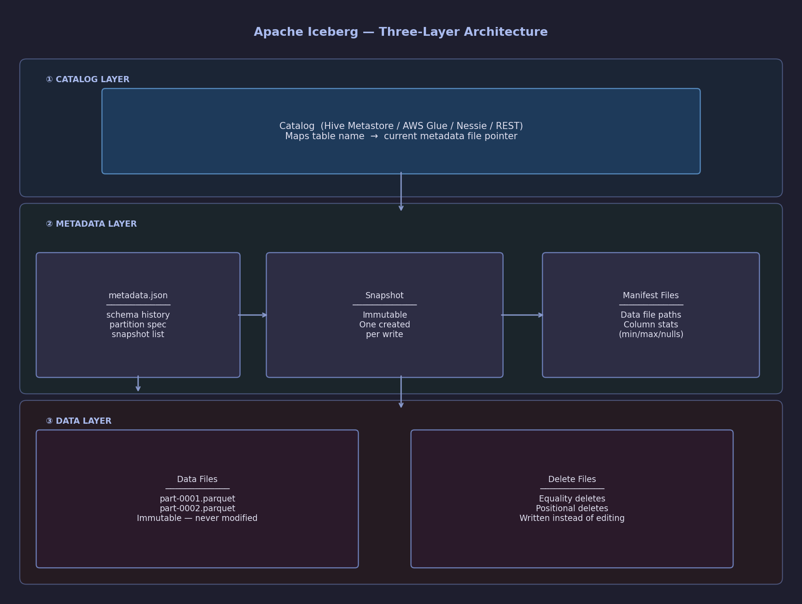
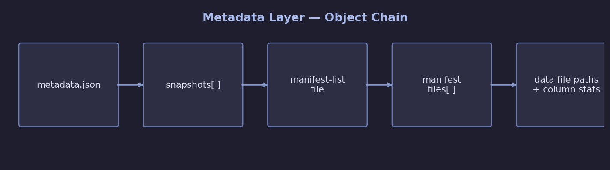
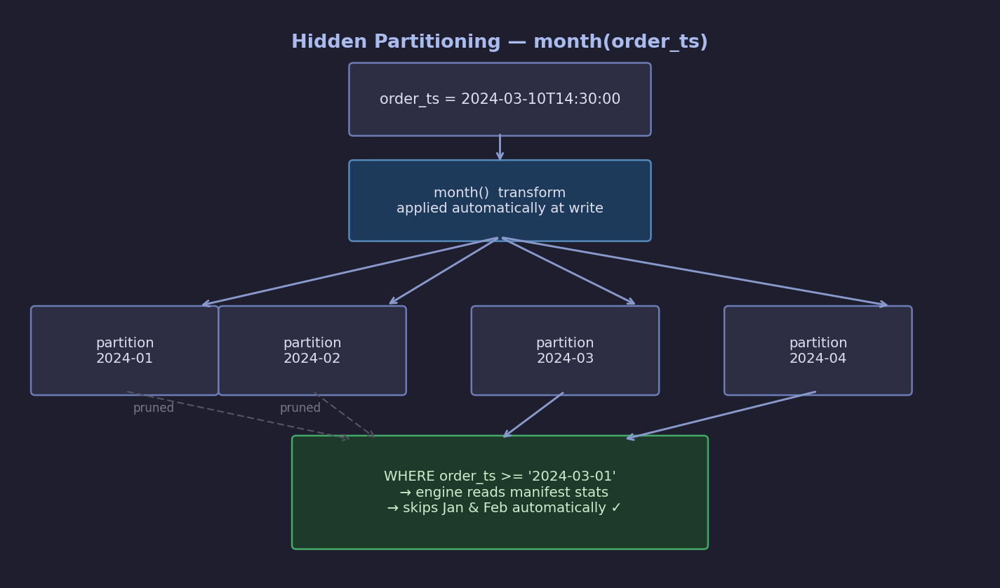
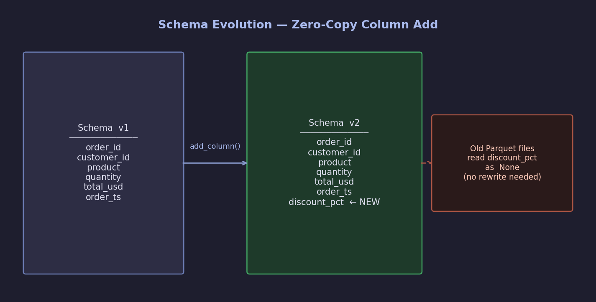
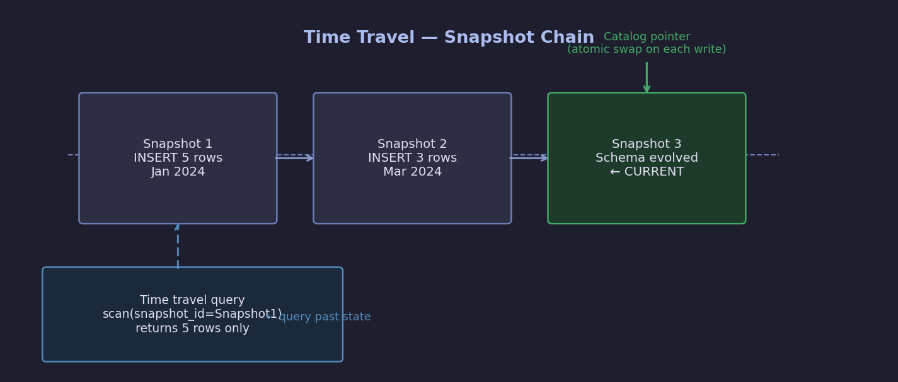
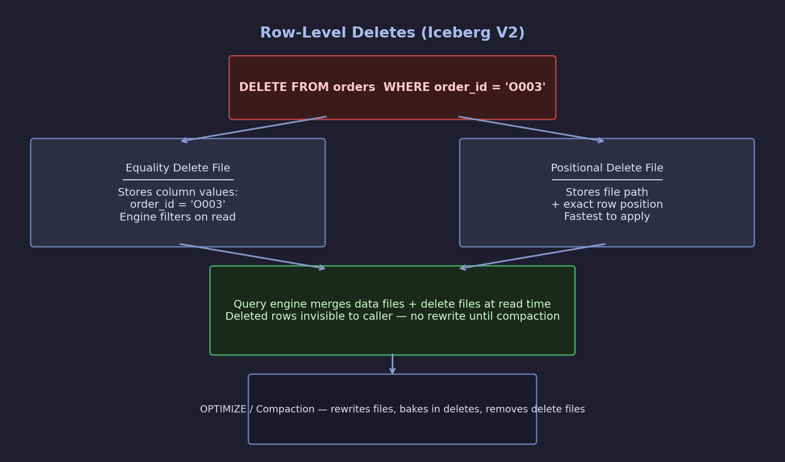

# Apache Iceberg Notes

Migrating from Delta Lake to Iceberg.

---

## Table of Contents

- [What is Iceberg?](#what-is-iceberg)
- [Why Iceberg over Delta Lake?](#why-iceberg-over-delta-lake)
- [The Three-Layer Architecture](#the-three-layer-architecture)
- [Key Features](#key-features)
- [Hands-On: PyIceberg Quick Start](#hands-on-pyiceberg-quick-start)
- [Whats Next](#whats-next)
- [Glossary](#glossary)

---

## What is Iceberg?

Apache Iceberg is an **open table format** that sits on top of raw files (Parquet, ORC, Avro) in object storage (S3, GCS, HDFS). It gives you a proper table abstraction — ACID transactions, schema history, time travel, and fast partition pruning — without locking you into any single compute engine.

Every major cloud and engine has converged on it: AWS (Athena, EMR, Glue), GCP (BigQuery), Azure (Fabric), Spark, Flink, Trino, DuckDB, Snowflake.

---

## Why Iceberg over Delta Lake?

| Feature | Delta Lake | Apache Iceberg |
|---|---|---|
| Open spec | Partially (Delta Kernel) | Fully open |
| Engine support | Spark-first | Engine-agnostic |
| Hidden partitioning | No | Yes |
| Schema evolution | Yes | Yes (richer) |
| Row-level deletes | Yes | Yes (V2: equality + positional) |
| Branching / tagging | No | Yes |
| Partition evolution | No | Yes |
| Multi-engine ACID | Limited | Strong |

The biggest practical win: **hidden partitioning** means your queries don't need to know the partition layout, and you can change partition strategies without rewriting data.

---

## The Three-Layer Architecture



### Catalog layer

Just a pointer: "table `shop.orders` lives at `s3://bucket/warehouse/shop/orders/metadata/v3.json`."

Swapping catalog backends (SQLite to Glue to Nessie) requires only a config change — all table code is identical.

### Metadata layer

The brain of Iceberg. Every write produces a new, **immutable snapshot**. The chain is:



This structure is what enables:
- **Time travel**: old snapshots are never deleted until you explicitly expire them.
- **ACID**: swapping the catalog pointer to a new metadata file is atomic.
- **Fast pruning**: column stats (min/max/null count) in manifests let the engine skip entire files without reading them.

### Data layer

Immutable Parquet (or ORC/Avro) files. Iceberg **never modifies a data file in-place**.

- Inserts: new data files.
- Updates: new data file with updated rows + a delete file marking old positions.
- Deletes: a delete file (positional or equality).
- Compaction (`OPTIMIZE`) periodically merges these for read performance.

---

## Key Features

### Hidden partitioning

In Hive/Delta you write partition columns explicitly and queries must match them. In Iceberg you declare a transform and queries prune automatically:



```python
# Define once at table creation
PartitionField(source_id=6, transform=MonthTransform(), name="order_ts_month")

# Query — no partition predicate needed, pruning is automatic
table.scan(row_filter="order_ts >= '2024-03-01'").to_arrow()
```

Supported transforms: `identity`, `bucket(N)`, `truncate(N)`, `year`, `month`, `day`, `hour`.

### Schema evolution

Add, drop, rename, or reorder columns without rewriting data. Each snapshot records which schema version it was written with, so old and new files coexist safely.



```python
with table.update_schema() as upd:
    upd.add_column("discount_pct", FloatType(), "Discount % applied")
    # upd.rename_column("total_usd", "total_amount")
    # upd.drop_column("legacy_field")
```

New column reads as `None` on old rows — fully backwards compatible.

### Time travel

Every write = new snapshot. Old snapshots are never deleted until you explicitly expire them. The catalog pointer atomically swaps to the latest — that's ACID.



Query any past state by snapshot ID or timestamp:

```python
# By snapshot ID
table.scan(snapshot_id=6308839735859792256).to_arrow()

# In Spark SQL
spark.sql("SELECT * FROM shop.orders VERSION AS OF 6308839735859792256")
spark.sql("SELECT * FROM shop.orders TIMESTAMP AS OF '2024-01-15'")
```

### Row-level deletes (Iceberg V2)

Two delete file types — no full file rewrites needed until compaction:



### Partition evolution

Change the partitioning strategy of an existing table without rewriting old data. Old files keep the old partition layout; new writes use the new one. The engine handles both transparently.

### Branching and tagging

Git-like operations on table state:

```python
# Create a branch for staging writes
table.manage_snapshots().create_branch("staging").commit()

# Tag the current snapshot as a release
table.manage_snapshots().create_tag("v2024-Q1-release").commit()
```

---

## Hands-On: PyIceberg Quick Start

### Install

```bash
pip install pyiceberg[pyarrow] sqlalchemy
```

### Full working lab

```python
import pyarrow as pa
import os, json
from pyiceberg.catalog.sql import SqlCatalog
from pyiceberg.schema import Schema
from pyiceberg.types import NestedField, StringType, FloatType, TimestampType, IntegerType
from pyiceberg.partitioning import PartitionSpec, PartitionField
from pyiceberg.transforms import MonthTransform
from datetime import datetime

# ── 1. Catalog setup ──────────────────────────────────────────────────────────
# SQLite for local dev; swap for Glue/Nessie/REST in production
catalog = SqlCatalog(
    "local",
    **{
        "uri": "sqlite:///catalog.db",
        "warehouse": "file:///tmp/iceberg_warehouse",
    },
)
catalog.create_namespace("shop")

# ── 2. Create table with hidden partitioning ──────────────────────────────────
schema = Schema(
    NestedField(1, "order_id",    StringType(),    required=False),
    NestedField(2, "customer_id", StringType(),    required=False),
    NestedField(3, "product",     StringType(),    required=False),
    NestedField(4, "quantity",    IntegerType(),   required=False),
    NestedField(5, "total_usd",   FloatType(),     required=False),
    NestedField(6, "order_ts",    TimestampType(), required=False),
)

partition_spec = PartitionSpec(
    PartitionField(source_id=6, field_id=1000, transform=MonthTransform(), name="order_ts_month")
)

table = catalog.create_table("shop.orders", schema=schema, partition_spec=partition_spec)

# ── 3. Insert data (creates Snapshot 1) ───────────────────────────────────────
batch = pa.table({
    "order_id":    ["O001", "O002", "O003"],
    "customer_id": ["C1",   "C2",   "C1"],
    "product":     ["Laptop", "Mouse", "Keyboard"],
    "quantity":    pa.array([1, 2, 1],              type=pa.int32()),
    "total_usd":   pa.array([999.99, 29.98, 79.99], type=pa.float32()),
    "order_ts":    pa.array([
        datetime(2024, 1, 10),
        datetime(2024, 1, 15),
        datetime(2024, 2, 5),
    ], type=pa.timestamp("us")),
})
table.append(batch)
snap1 = table.current_snapshot()
print(f"Snapshot 1 id: {snap1.snapshot_id}")

# ── 4. Time travel ────────────────────────────────────────────────────────────
df_past = table.scan(snapshot_id=snap1.snapshot_id).to_arrow()

# ── 5. Schema evolution ───────────────────────────────────────────────────────
with table.update_schema() as upd:
    upd.add_column("discount_pct", FloatType(), "Discount % applied")

# ── 6. Inspect snapshots ──────────────────────────────────────────────────────
for entry in table.history():
    print(f"  id={entry.snapshot_id}  ts={entry.timestamp_ms}")

# ── 7. Inspect data files by partition ────────────────────────────────────────
for task in table.scan().plan_files():
    print(f"  {task.file.file_path}  rows={task.file.record_count}")

# ── 8. Peek at raw metadata JSON ──────────────────────────────────────────────
meta_path = table.metadata_location.replace("file://", "")
with open(meta_path) as f:
    meta = json.load(f)
print(f"format-version: {meta['format-version']}")
print(f"schemas stored: {len(meta['schemas'])}")
print(f"snapshots stored: {len(meta['snapshots'])}")
```

### What this lab proves

| Step | What you see | Why it matters |
|---|---|---|
| Table creation | Fields + partition spec | Schema + partition defined separately from files |
| Snapshot 1 | snapshot_id assigned | Every write = new immutable snapshot |
| Time travel | 3 rows (not current 8) | Old snapshots preserved — instant rollback |
| Schema evolution | `discount_pct = None` on old rows | Zero-copy column add, backwards compatible |
| `plan_files()` | One file per month | Hidden partitioning split data automatically |
| `metadata.json` | 2 schemas, 2 snapshots | Full audit trail in plain JSON |

---

## Whats Next

- [ ] **Iceberg V2 row-level deletes** — equality vs positional delete files, `MERGE INTO` in Spark
- [ ] **Compaction** — `OPTIMIZE` table, expire snapshots, remove orphan files
- [ ] **Partition evolution** — change partition strategy without rewriting old data
- [ ] **Branching and tagging** — `staging` branch, `main` fast-forward, release tags
- [ ] **Production catalogs** — AWS Glue vs Nessie vs REST; connecting Spark / Trino / DuckDB
- [ ] **Spark integration** — `spark.read.format("iceberg")`, `CREATE TABLE USING iceberg`
- [ ] **Trino / DuckDB queries** — same Iceberg table, different engines
- [ ] **Delta Lake to Iceberg migration** — `delta-iceberg` converter, shadow table strategy

---

## Glossary

| Term | Definition |
|---|---|
| **Catalog** | Registry mapping table names to metadata file locations |
| **Snapshot** | Immutable point-in-time state of a table; created on every write |
| **Manifest list** | File listing all manifest files for a snapshot |
| **Manifest file** | File listing data/delete files with their column-level statistics |
| **Data file** | Immutable Parquet/ORC/Avro file holding actual rows |
| **Delete file** | File recording which rows are logically deleted (positional or equality) |
| **Hidden partitioning** | Partition pruning driven by metadata, invisible to queries |
| **Partition transform** | Function applied to a column to derive the partition value (month, bucket, etc.) |
| **Schema evolution** | Adding/dropping/renaming columns without rewriting data files |
| **Time travel** | Querying a past snapshot by ID or timestamp |
| **Compaction** | Rewriting small/fragmented files into larger ones for read performance |
| **Equality delete** | Delete file that identifies rows by column values |
| **Positional delete** | Delete file that identifies rows by file path + row position |
| **Iceberg V2** | Table format version adding row-level delete support |
