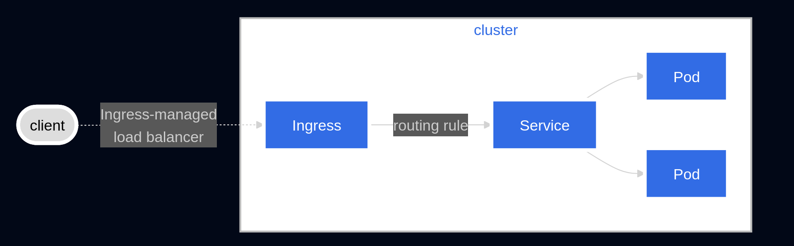
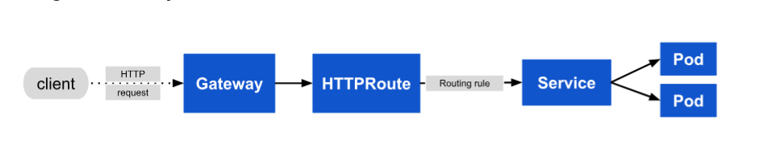

### What is an ingress?

Ingress allows to centralize external access through a single entry point. Ingress exposes HTTP and HTTPS routes from outside the cluster to services within the cluster. Traffic routing is controlled by rules defined on the Ingress resource.




example ingress resource:
```bash
apiVersion: networking.k8s.io/v1
kind: Ingress
metadata:
  name: minimal-ingress
spec:
  ingressClassName: nginx-example
  rules:
  - http:
      paths:
      - path: /testpath
        pathType: Prefix
        backend:
          service:
            name: test
            port:
              number: 80

```

--
### ingress controllers 
An Ingress Controller is a specialized component that implements ingress. 
Ingress Controllers are deployed as separate agents in the cluster, and you can run multiple controllers with different config. These controllers use Ingress Rules - Kubernetes API resources that you create with kubectl - to determine how external traffic should be routed to internal Services. 
Example: GKE Ingress, Envoy, HAProxy 

In summary:
The Ingress Controller is a Pod running a reverse proxy (like NGINX) alongside a controller process that continuously watches the Kubernetes API for Ingress resources and Service changes. When changes are detected, it dynamically updates the reverse proxy configuration to route external HTTP/HTTPS traffic to the appropriate Services.

Limitations:

- Can't route non-HTTP protocols like TCP or gRPC directly 
- Routing based on HTTP headers isn't supported out of the box
- Canary traffic splitting isn't natively available 

For advacned traffic managerment, choose, Gateway API and Service Mesh. Gateway API has three resources (GatewarClass, Gateway, Routes). 


---
GatewayClass: Cluster-scoped resource - applied to the entire cluster (not just to a singal namespace). Gateways are provisioned according to organizational policies, thus, either cluster admin or the platform team often create/manage, and establish the standards for networking. Dev focus on creating routes. 
The most important part of a GatewayClass is the spec.controllerName field. 

```
apiVersion: gateway.networking.k8s.io/v1
kind: GatewayClass
metadata:
  name: example-class
spec:
  controllerName: example.com/gateway-controller
```

 In this example, any Gateway that references example-class will be managed by the controller identified as example.com/gateway-controller.
 Gateway API controllers:  
 https://gateway-api.sigs.k8s.io/implementations/#gateway-controller-implementation-status

 -----
 Gateway: main entry point for external traffic entering your cluster. This resource works closely with a GatewayClass. While the Gateway resource declares the desired configuration (for example, "accept HTTP traffic on port 80"), the GatewayClass specifies which controller is responsible for implementing that configuration. This separation ensures that infrastructure management (handled by administrators) is distinct from application-specific routing (managed by developers), improving both security and flexibility. For example, a Gateway can handle TLS termination, ensuring that encrypted traffic is properly secured before being passed to backend Services. It can also enforce cross-namespace policies, enabling safe multi-tenant usage where administrators control the entry point while developers define routing rules independently.
 example:
 ```
 apiVersion: gateway.networking.k8s.io/v1
kind: Gateway
metadata:
  name: example-gateway
spec:
  gatewayClassName: example-class
  listeners:
  - name: http
    protocol: HTTP
    port: 80
 ```
 The *gatewayClassName* field links the Gateway to the example-class *GatewayClass*, ensuring that the appropriate controller manages it. The listener named http is configured to accept HTTP traffic on port 80.

 ----
 HTTPRoute: how HTTP traffic is handled and routed within your Kubernetes cluster?? It gives developers fine-grained control over request routing by allowing rules to be created based on attributes such as hostnames, paths, headers, and query parameters. This flexibility enables advanced techniques such as weighted routing (distributing traffic across multiple services) and canary deployments (gradually rolling out new versions). It’s a step up from basic routing, helping you manage traffic with greater control.

 ```
 apiVersion: gateway.networking.k8s.io/v1
kind: HTTPRoute
metadata:
  name: example-httproute
spec:
  parentRefs:
  - name: example-gateway
  hostnames:
  - "www.example.com"
  rules:
  - matches:
    - path:
      type: PathPrefix
      value: /login
    backendRefs:
    - name: example-svc
      port: 8080
 ```
 - The parentRefs field links the HTTPRoute to the example-gateway, ensuring the Gateway processes the defined rules.
- The hostnames field restricts routing to traffic destined for www.example.com.
- The rules section defines a match for requests with the path prefix /login.
- Matching requests are forwarded to the example-svc Service on port 8080.