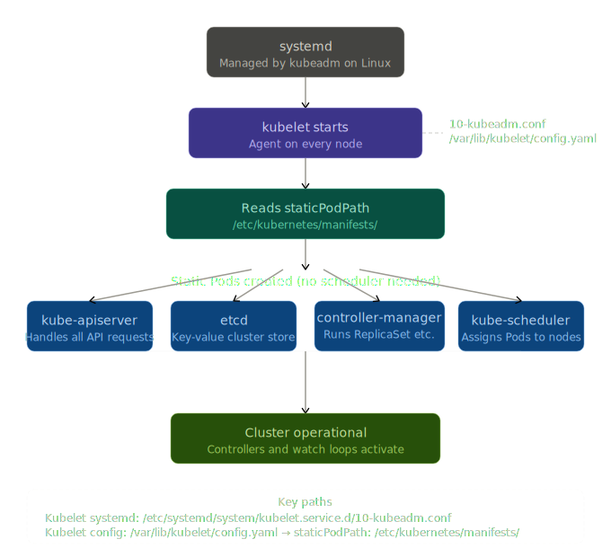

# K8s Cluster Startup 

## Overview
When a Kubernetes cluster starts, `systemd` launches the `kubelet` — the node agent that uniquely needs nothing else running to do its job. The kubelet reads its config, finds the `staticPodPath`, and directly creates the four control plane Pods (API server, etcd, controller-manager, scheduler) from YAML files in `/etc/kubernetes/manifests/` — no scheduler, no API server needed yet. Once those Pods are up, the cluster becomes self-aware and takes over from there.

## Startup Chain

```
systemd → kubelet → /etc/kubernetes/manifests/ → static Pods → cluster up
```

## Key Paths
| Path | What |
|---|---|
| `/etc/systemd/system/kubelet.service.d/10-kubeadm.conf` | Kubelet systemd config |
| `/var/lib/kubelet/config.yaml` | Contains `staticPodPath` |
| `/etc/kubernetes/manifests/` | Static Pod YAMLs (apiserver, etcd, controller-manager, scheduler) |

## Must Know
- **Static Pods** = started directly by kubelet, no scheduler needed
- Kubelet is the **only** component that runs without the rest of K8s
- Editing a file in `/etc/kubernetes/manifests/` → kubelet picks it up automatically

## Commands
```bash
systemctl status kubelet.service        # kubelet health check
cat /var/lib/kubelet/config.yaml        # find staticPodPath
ls /etc/kubernetes/manifests/           # list control plane pod YAMLs
```

## CKA Tips
- Control plane broken? → Edit YAML directly in `/etc/kubernetes/manifests/`
- Kubelet not starting? → `systemctl status kubelet.service` first
- Static Pods show in `kubectl get pods` but are **not** controlled by the API server
