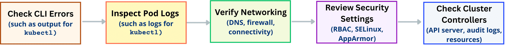

# K8s Troubleshooting 

## Overview
When something breaks, always go outer-to-inner: CLI → Pod → Network → Security → Cluster.



---

## Cheat Sheet

### 1. Check CLI Errors
Misconfigured YAML or permission issues surface here first.
```bash
kubectl get pods
kubectl describe pod <pod-name>
```

### 2. Inspect Pod Logs
Identify states: `Pending`, `CrashLoopBackOff`, `Error`.
```bash
kubectl logs <pod-name>
kubectl exec -it <pod-name> -- /bin/bash          # if shell available
kubectl create deployment debug --image=busybox -- sleep 3600  # debug pod
kubectl exec -it <debug-pod> -- /bin/sh
```

### 3. Verify Networking
DNS failures and firewall rules are the most common culprits.
```bash
kubectl exec -it <pod-name> -- nslookup <service-name>
kubectl exec -it <pod-name> -- curl <service-url>
kubectl exec -it <debug-pod> -- tcpdump -i eth0   # deep inspection
kubectl exec -it <debug-pod> -- ping <other-node-ip>
kubectl get pods -n kube-system | grep <cni-plugin>
```

### 4. Review Security Settings
RBAC, SELinux, AppArmor can silently block workloads.
```bash
kubectl auth can-i <action> <resource> --as=<user>
```
Check `spec.securityContext` in the PodSpec for SELinux/AppArmor settings.

### 5. Check Cluster Controllers & Nodes
Node resources (CPU/mem/disk) and control plane health.
```bash
kubectl get nodes
kubectl describe node <node-name>
kubectl top nodes                                  # needs Metrics Server
kubectl logs -n kube-system <controller-pod-name>
```

---

## CKA Tips
- No shell in container? → Deploy a `busybox` debug Pod
- "Forbidden" errors? → Check RBAC with `kubectl auth can-i`
- Pod stuck `Pending`? → Check node resources (`kubectl describe node`)
- Cluster-wide issues? → Check `kube-system` namespace logs and API server audit logs
