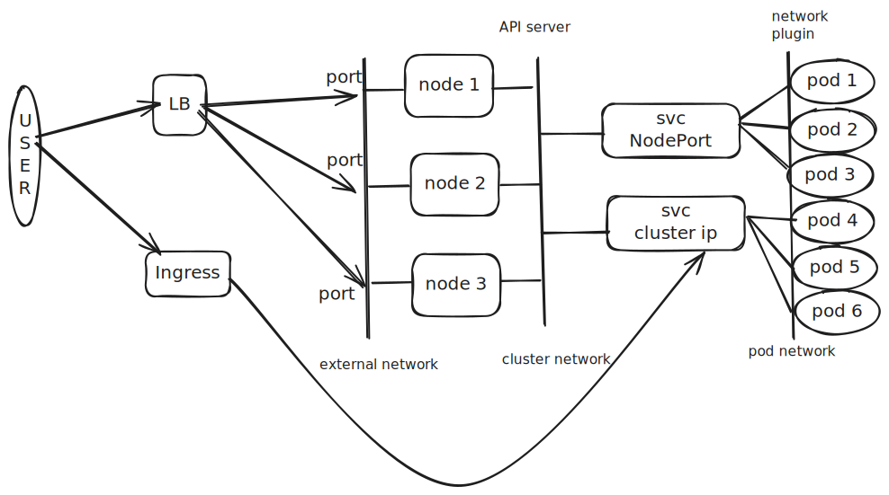

In Kubernetes, networking happen at different levels:
- Between containers: implemented by IPC
- Between Pods: implemented by network plugins
- Between Pods and Services: implemented by Service resources 
- Between external users and Services: Implemented by Services, with the help of Ingress or Gateway API 

How to manage Incoming Traffic? 
- Ingress has been the solution for a long time, however, to be replaced by Gateway API 

Let's understand the high level networking flow 
