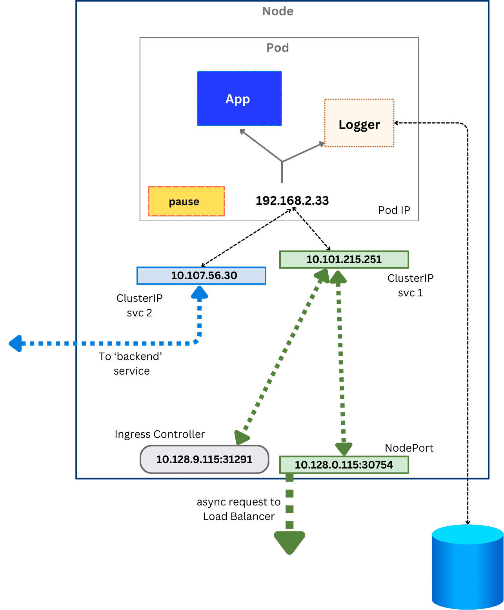

In Kubernetes, networking happen at different levels:
- Between containers: implemented by IPC
- Between Pods: implemented by network plugins
- Between Pods and Services: implemented by Service resources 
- Between external users and Services: Implemented by Services, with the help of Ingress or Gateway API 

How to manage Incoming Traffic? 
- Ingress has been the solution for a long time, however, to be replaced by Gateway API 

Let's understand the high level networking flow 


### how Services Communicate through the network 

#### Service Traffic Flow

Client request

A user sends traffic to any node’s public IP on the assigned NodePort (for example, 35001).

Node firewall rule

The kube-proxy on that node has already configured a firewall rule (using iptables or ipvs) to recognize traffic for this NodePort.

Service mapping

The traffic is redirected from the NodePort to the ClusterIP of the Service, which acts as a stable entry point.

Endpoint resolution

The Service consults its Endpoints list, which keeps track of the actual Pod IPs running the application.

Pod delivery

The request is forwarded to one of the Pod IPs (for example, 10.128.0.44) running the application (MyApp).

Load balancing

If multiple Pods match the Service’s selector, traffic is automatically distributed across them, providing high availability and reliability.

###  traffic flow through a multi-container Pod with multiple Services
Kubernetes Networking Architecture Diagram


The diagram above illustrates the complete traffic flow in Kubernetes networking.
## Pod Structure
- **Multi-container Pod** on worker node (e.g., App + Logger sidecar)
- **Pod IP**: Ephemeral (e.g., 192.168.2.33:31291) - changes on restart
- **Container IPs**: Each container shares the Pod's IP

## Services - Stable Abstraction Layer
- **ClusterIP Services** (e.g., 10.101.215.251, 10.107.56.30)
  - Provide stable IPs for internal cluster communication
  - Track Pod IPs dynamically via EndpointSlices
  - Decouple clients from changing Pod IPs
  - Internal-only access

## External Access Methods

### NodePort Service
- **Example**: 10.128.0.115:30754
- Exposes service on static high-numbered port (30000-32767) on every node
- External clients access via: `<NodeIP>:<NodePort>`
- Built on top of ClusterIP

### Ingress Controller
- **Dedicated Pod** acting as HTTP/HTTPS entry point
- Listens on node port (e.g., 10.128.9.115:80)
- Routes external traffic to Services based on URL rules
- Typically routes to ClusterIP Services (can also route to NodePort/LoadBalancer)
- Smart Layer 7 routing (hostname, path-based)

### LoadBalancer Service (Cloud Only)
- Provisions external load balancer (AWS ELB, GCP LB, etc.)
- Distributes traffic across nodes
- Forwards to underlying NodePort → ClusterIP → Pods
- Not available on bare metal without MetalLB

## Traffic Flow Summary

### Internal Traffic:
```
Pod/Client → ClusterIP Service → EndpointSlices → Pod IP → Container
```

### External via NodePort:
```
External Client → NodeIP:NodePort → ClusterIP → Pod
```

### External via Ingress:
```
External Client → Ingress (80/443) → ClusterIP Service → Pod
```

### External via LoadBalancer:
```
External Client → Cloud LB → NodePort → ClusterIP → Pod
```

## Key Concepts
- **Pods/Container IPs**: Ephemeral, change on restart
- **Services**: Stable abstraction, track Pods via labels/selectors
- **EndpointSlices**: Dynamic list of Pod IPs backing a Service
- **Ingress**: Layer 7 HTTP/HTTPS routing to Services
- **NodePort**: Simple external access via node ports
- **LoadBalancer**: Cloud-managed external access with LB

## Service Type Hierarchy
```
LoadBalancer (Cloud LB + NodePort + ClusterIP)
    ↓
NodePort (Node Port + ClusterIP)
    ↓
ClusterIP (Base - Internal only)
```