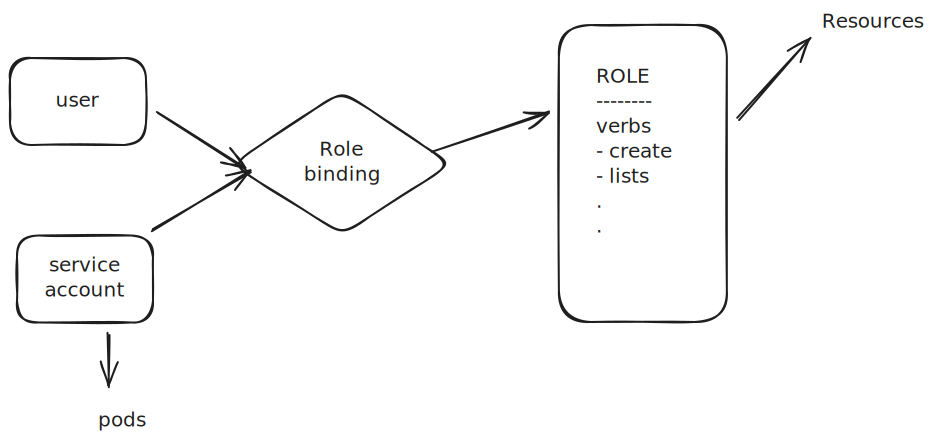

# Kubernetes RBAC Guide

## Core Components

RBAC uses four main API resources to regulate access:


 


### 1. Subjects (The Who)

- **User:** Individual human users (managed externally)
- **ServiceAccount:** Identities for processes/pods (managed by K8s)
- **Group:** Sets of users

### 2. Permissions (The What)

| Object | Scope | Best For |
|:---|:---|:---|
| **Role** | Namespace | App developers, specific workloads |
| **ClusterRole** | Cluster | Admins, monitoring tools, nodes |

> **💡 Tip:** **Rules** consist of:
> - `apiGroups`: (e.g., "" for core, "apps" for deployments)
> - `resources`: (e.g., "pods", "secrets", "nodes")
> - `verbs`: (e.g., "get", "list", "create")

### 3. Bindings (The Glue)

- **RoleBinding:** Grants permissions within a specific namespace
- **ClusterRoleBinding:** Grants permissions across the entire cluster

---

## CKA Command Cheat Sheet
```bash
# Check if a user can perform an action
kubectl auth can-i create pods --as alice

# Create a role imperatively
kubectl create role pod-reader --verb=get,list --resource=pods

# Bind a role to a user
kubectl create rolebinding alice-pod-reader --role=pod-reader --user=alice
```

---

## Setting up RBAC for ServiceAccounts

### Step 1: Create and Deploy Pod
```bash
# Create a deployment file
kubectl run mypod --image=alpine --dry-run=client -o yaml -- sleep 3600 > mypod.yaml

# Deploy
kubectl apply -f mypod.yaml
```

### Step 2: Test Default ServiceAccount Permissions
```bash
# SSH into your pod
kubectl exec -it mypod -- sh

# Add curl command
apk add curl

# Check if you can access the resources
# You won't be able to because default SA does not have the permission
# Expect "Forbidden"
curl https://kubernetes/api/v1 --insecure

# Create a token using the default SA
TOKEN=$(cat /run/secrets/kubernetes.io/serviceaccount/token)
echo $TOKEN

# Use the token to access the same resource, expect success
curl -H "Authorization: Bearer $TOKEN" https://kubernetes/api/v1 --insecure

# Try to access namespace resources and expect failure "Forbidden"
curl -H "Authorization: Bearer $TOKEN" https://kubernetes/api/v1/namespaces/default/pods/ --insecure
```

### Step 3: Create Custom ServiceAccount with Permissions
```bash
# Create a service account
kubectl create sa mysa

# Add a role
kubectl create role list-pods --resource=pods --verb=list
kubectl create role -h | less

# Create a rolebinding
kubectl create rolebinding list-pods --role=list-pods --serviceaccount=default:mysa
```

### Step 4: Update Pod Configuration
```yaml
# Update pod config - add Service account
apiVersion: v1
kind: Pod
metadata:
  name: mypod
spec:
  serviceAccountName: mysa
  containers:
  - command:
    - "sleep"
    - "3600"
    image: alpine
    name: mypod
```

### Step 5: Deploy and Test
```bash
# Deploy config
kubectl apply -f mypod.yaml

# SSH into my pod
kubectl exec -it mypod -- sh

# Add curl
apk add curl

# Create token
TOKEN=$(cat /run/secrets/kubernetes.io/serviceaccount/token)
echo $TOKEN

# Try to access the resource now and expect success
curl -H "Authorization: Bearer $TOKEN" https://kubernetes/api/v1/namespaces/default/pods --insecure
```

---

## ClusterRoles and ClusterRoleBindings
```bash
# View cluster roles
kubectl get clusterrole

# View cluster role bindings
kubectl get clusterrolebinding
```

---

## Quick Reference

### Common RBAC Commands
```bash
# List roles in current namespace
kubectl get roles

# List rolebindings in current namespace
kubectl get rolebindings

# Describe a specific role
kubectl describe role <role-name>

# Check your own permissions
kubectl auth can-i --list
```