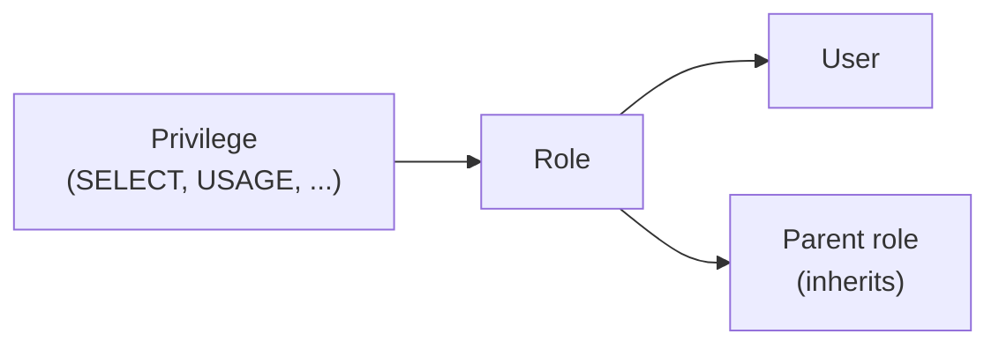

# Snowflake Access Control (RBAC)

> How privileges flow in Snowflake, the system roles, and a role hierarchy that scales.

---

## Core Model

Snowflake combines two models:

- **DAC (Discretionary Access Control):** every object has an *owner* role, and the owner can grant access to it.
- **RBAC (Role-Based Access Control):** privileges are granted to **roles**, roles are granted to **users** (or to other roles).



> **💡 Key rule:** Privileges are never granted directly to users. Always grant to a role.

---

## System-Defined Roles

| Role | Purpose |
|:---|:---|
| **ORGADMIN** | Manages accounts across the organization |
| **ACCOUNTADMIN** | Top-level role; encapsulates SECURITYADMIN + SYSADMIN. Use sparingly |
| **SECURITYADMIN** | Manages grants globally (`MANAGE GRANTS`); inherits USERADMIN |
| **USERADMIN** | Creates and manages users and roles |
| **SYSADMIN** | Creates warehouses, databases and other objects |
| **PUBLIC** | Granted to every user automatically |

**Best practice:** grant every custom role up to `SYSADMIN` so admins can manage the objects those roles create.

```
ACCOUNTADMIN
├── SECURITYADMIN
│   └── USERADMIN
└── SYSADMIN
    ├── DATA_ENGINEER   (functional)
    │   └── RAW_RW      (access)
    └── ANALYST         (functional)
        └── ANALYTICS_RO (access)
```

---

## Access Roles vs Functional Roles

A common pattern to keep grants manageable:

- **Access roles** hold object privileges (e.g., `ANALYTICS_RO` = read on the ANALYTICS db).
- **Functional roles** represent a job (e.g., `ANALYST`) and are granted a set of access roles.
- Users only get functional roles.

```sql
USE ROLE USERADMIN;
CREATE ROLE analytics_ro;
CREATE ROLE analyst;

USE ROLE SECURITYADMIN;
-- Access role: read-only on a database
GRANT USAGE ON DATABASE analytics TO ROLE analytics_ro;
GRANT USAGE ON ALL SCHEMAS IN DATABASE analytics TO ROLE analytics_ro;
GRANT SELECT ON ALL TABLES IN DATABASE analytics TO ROLE analytics_ro;
GRANT SELECT ON FUTURE TABLES IN DATABASE analytics TO ROLE analytics_ro;

-- Wire up the hierarchy
GRANT ROLE analytics_ro TO ROLE analyst;
GRANT ROLE analyst      TO ROLE sysadmin;
GRANT USAGE ON WAREHOUSE bi_wh TO ROLE analyst;

GRANT ROLE analyst TO USER jdoe;
```

> **⚠️ Gotcha:** `ON ALL` covers only existing objects. Add `ON FUTURE` grants so new tables are covered too. If future grants exist at both database and schema level, the **schema-level** ones win.

---

## Managed Access Schemas

In a regular schema, the object owner can grant access. In a **managed access schema**, only the schema owner (or a role with `MANAGE GRANTS`) can — this centralizes control.

```sql
CREATE SCHEMA analytics.finance WITH MANAGED ACCESS;
ALTER SCHEMA analytics.marts ENABLE MANAGED ACCESS;
```

---

## Secondary Roles

A session has one primary role but can activate secondary roles, so a user gets the union of privileges for queries (object creation still uses the primary role).

```sql
USE SECONDARY ROLES ALL;
```

---

## Cheat Sheet

```sql
SHOW GRANTS TO ROLE analyst;          -- what a role can do
SHOW GRANTS OF ROLE analyst;          -- who holds the role
SHOW GRANTS TO USER jdoe;             -- roles granted to a user
SHOW FUTURE GRANTS IN DATABASE analytics;
REVOKE SELECT ON ALL TABLES IN SCHEMA analytics.raw FROM ROLE analytics_ro;
```

## Checklist

- [ ] Nobody uses ACCOUNTADMIN as a default role
- [ ] At least two users hold ACCOUNTADMIN (break-glass), both with MFA
- [ ] All custom roles roll up to SYSADMIN
- [ ] Future grants set on every database/schema that gets new objects
