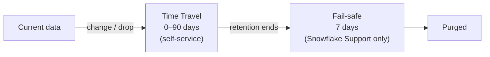

# Snowflake Time Travel & Fail-safe

> Querying and restoring data from the past, and what happens after Time Travel runs out.

---

## The Data Lifecycle



| Table type | Time Travel | Fail-safe |
|:---|:---|:---|
| Permanent | 0–1 day (Standard), 0–90 days (Enterprise+) | 7 days |
| Transient | 0–1 day | None |
| Temporary | 0–1 day (session only) | None |

> **💡 Tip:** Use **transient** tables for staging/scratch data you can rebuild. You skip Fail-safe storage costs entirely.

---

## Setting Retention

Retention is set with `DATA_RETENTION_TIME_IN_DAYS` and inherits account → database → schema → table.

```sql
ALTER ACCOUNT  SET DATA_RETENTION_TIME_IN_DAYS = 1;
ALTER DATABASE analytics SET DATA_RETENTION_TIME_IN_DAYS = 30;
ALTER TABLE    analytics.marts.orders SET DATA_RETENTION_TIME_IN_DAYS = 90;

-- Guardrail: nobody can set retention below this anywhere in the account
ALTER ACCOUNT SET MIN_DATA_RETENTION_TIME_IN_DAYS = 7;

CREATE TRANSIENT TABLE staging.tmp_orders (...);
```

---

## Querying the Past

```sql
-- 30 minutes ago
SELECT * FROM orders AT(OFFSET => -60 * 30);

-- At a point in time
SELECT * FROM orders AT(TIMESTAMP => '2026-09-29 14:00:00'::TIMESTAMP_LTZ);

-- Just before a bad statement ran
SELECT * FROM orders BEFORE(STATEMENT => '01b2c3d4-0000-1234-0000-000123456789');
```

---

## Recovering from Mistakes

### Bad UPDATE / DELETE

```sql
-- Option 1: restore into a new table, check it, then swap
CREATE TABLE orders_restored CLONE orders
  BEFORE(STATEMENT => '<query_id_of_bad_delete>');

ALTER TABLE orders SWAP WITH orders_restored;
```

### Dropped object

```sql
DROP TABLE orders;
UNDROP TABLE orders;

SHOW TABLES HISTORY LIKE 'orders' IN SCHEMA analytics.marts;   -- see dropped versions
UNDROP SCHEMA analytics.marts;
UNDROP DATABASE analytics;
```

> **⚠️ Gotcha:** `UNDROP` fails if an object with the same name already exists. Rename the current one first: `ALTER TABLE orders RENAME TO orders_new;`

---

## Fail-safe

- **Not** self-service. Only Snowflake Support can recover data from Fail-safe, on a best-effort basis.
- It's for disasters, not for everyday "oops" restores.
- You still pay storage for it, which can be a surprise on tables with heavy churn.

```sql
-- How much storage is going to Time Travel / Fail-safe?
SELECT table_catalog, table_schema, table_name,
       active_bytes      / POWER(1024, 3) AS active_gb,
       time_travel_bytes / POWER(1024, 3) AS time_travel_gb,
       failsafe_bytes    / POWER(1024, 3) AS failsafe_gb
FROM snowflake.account_usage.table_storage_metrics
WHERE deleted IS NULL OR deleted = FALSE
ORDER BY failsafe_gb DESC
LIMIT 20;
```

## Checklist

- [ ] Critical tables have longer retention (e.g., 30–90 days on Enterprise)
- [ ] Staging / rebuildable tables are transient
- [ ] `MIN_DATA_RETENTION_TIME_IN_DAYS` set as a guardrail
- [ ] Team knows the "clone BEFORE statement → swap" restore pattern
