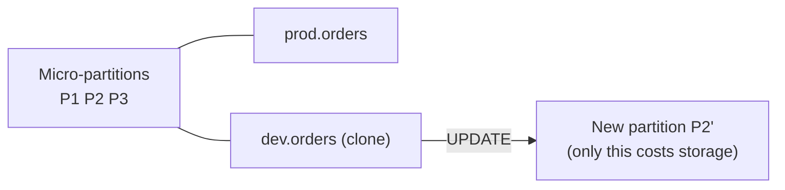

# Snowflake Zero-Copy Cloning

> Instant copies of tables, schemas and databases that share storage until the data changes.

---

## How It Works

A clone copies **metadata only**. Both objects point to the same micro-partitions, and new storage is used only for partitions that change after the clone.



---

## Syntax

```sql
CREATE TABLE    dev.orders       CLONE prod.orders;
CREATE SCHEMA   analytics.qa     CLONE analytics.marts;
CREATE DATABASE analytics_dev    CLONE analytics;

-- Clone combined with Time Travel
CREATE TABLE orders_yesterday CLONE orders AT(OFFSET => -60 * 60 * 24);

-- Keep the source table's grants
CREATE TABLE orders_copy CLONE orders COPY GRANTS;
```

---

## Common Admin Use Cases

| Use case | Pattern |
|:---|:---|
| Dev / test environments | `CREATE DATABASE analytics_dev CLONE analytics;` nightly |
| Safe deploys | Clone → run migration on clone → validate → `SWAP WITH` |
| Point-in-time snapshot | Clone with `AT(TIMESTAMP => ...)` before month-end close |
| CI for dbt | Clone prod schema per PR, run models, drop after |

```sql
-- Blue/green deploy for a table
CREATE TABLE orders_v2 CLONE orders;
-- ... run migration on orders_v2 and test it ...
ALTER TABLE orders SWAP WITH orders_v2;
```

---

## What Gets Cloned (and What Doesn't)

| Object | Behavior |
|:---|:---|
| Tables, views, sequences, file formats | Cloned |
| Grants on child objects (db/schema clone) | Copied to the cloned children |
| Grants on the database/schema itself | **Not** copied |
| Internal named stages | **Not** cloned |
| Tasks | Cloned but **suspended**. Resume them deliberately |
| Streams | Cloned, but unconsumed records in the clone are inaccessible |

> **⚠️ Gotcha:** A cloned dev database with resumed tasks can write into shared targets or send alerts. Check `SHOW TASKS IN DATABASE analytics_dev;` after every clone.

> **⚠️ Gotcha:** Clones are cheap at first but drift over time. A long-lived dev clone of a busy table will eventually cost as much as a full copy. Refresh or drop them regularly.

---

## Cleanup

```sql
SHOW DATABASES LIKE '%_DEV%';

-- Clone lineage: which tables share storage with which
SELECT table_catalog, table_name, clone_group_id, active_bytes
FROM snowflake.account_usage.table_storage_metrics
WHERE clone_group_id IS NOT NULL
ORDER BY clone_group_id;
```

## Checklist

- [ ] Dev/test databases built from clones, not full copies
- [ ] Tasks in cloned databases reviewed before resuming
- [ ] Old clones dropped on a schedule
- [ ] Database-level grants re-applied after cloning
