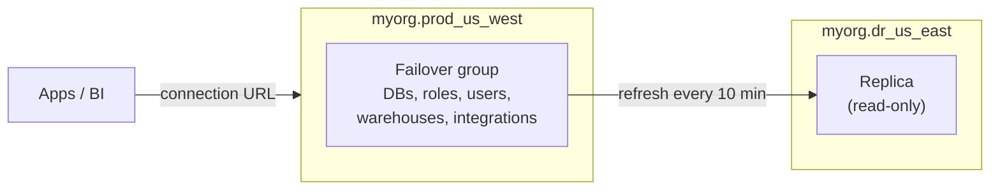

# Snowflake Replication & Failover

> Copying databases and account objects to another region or cloud, and failing over when things break.

---

## Concepts

| Term | Meaning |
|:---|:---|
| **Replication group** | Set of objects replicated together to other accounts (read-only replicas) |
| **Failover group** | Replication group whose replica can be **promoted** to primary (Business Critical+) |
| **Client redirect** | A *connection* URL that can be pointed at whichever account is primary |
| **RPO / RTO** | Driven by `REPLICATION_SCHEDULE` and how fast you promote |



---

## Step 1: Enable Replication (ORGADMIN)

```sql
USE ROLE ORGADMIN;
SHOW ACCOUNTS;

SELECT SYSTEM$GLOBAL_ACCOUNT_SET_PARAMETER(
  'myorg.prod_us_west', 'ENABLE_ACCOUNT_DATABASE_REPLICATION', 'true');
SELECT SYSTEM$GLOBAL_ACCOUNT_SET_PARAMETER(
  'myorg.dr_us_east',   'ENABLE_ACCOUNT_DATABASE_REPLICATION', 'true');
```

## Step 2: Create the Failover Group (Primary)

```sql
USE ROLE ACCOUNTADMIN;
CREATE FAILOVER GROUP prod_fg
  OBJECT_TYPES       = DATABASES, ROLES, USERS, WAREHOUSES,
                       RESOURCE MONITORS, INTEGRATIONS, NETWORK POLICIES
  ALLOWED_DATABASES  = analytics, raw
  ALLOWED_INTEGRATION_TYPES = SECURITY INTEGRATIONS, STORAGE INTEGRATIONS
  ALLOWED_ACCOUNTS   = myorg.dr_us_east
  REPLICATION_SCHEDULE = '10 MINUTE';
```

## Step 3: Create the Replica (Secondary)

```sql
USE ROLE ACCOUNTADMIN;
CREATE FAILOVER GROUP prod_fg
  AS REPLICA OF myorg.prod_us_west.prod_fg;

ALTER FAILOVER GROUP prod_fg REFRESH;   -- first full sync
```

## Step 4: Client Redirect

```sql
-- On primary
CREATE CONNECTION prod_conn;
ALTER CONNECTION prod_conn ENABLE FAILOVER TO ACCOUNTS myorg.dr_us_east;

-- On secondary
CREATE CONNECTION prod_conn AS REPLICA OF myorg.prod_us_west.prod_conn;
```

Apps connect to `myorg-prod_conn.snowflakecomputing.com` instead of an account URL.

---

## Failing Over

Run on the **secondary** account:

```sql
ALTER FAILOVER GROUP prod_fg PRIMARY;   -- promote replica
ALTER CONNECTION prod_conn PRIMARY;     -- move client traffic
```

> **⚠️ Gotcha:** Anything written to the old primary after its last refresh is not on the new primary. That's your RPO, so keep the schedule short for critical data.

> **💡 Tip:** Run a planned failover drill at least once. Check that tasks, pipes, and integrations behave as expected on the new primary.

---

## Monitoring

```sql
SHOW FAILOVER GROUPS;
SHOW REPLICATION DATABASES;

SELECT phase_name, start_time, end_time, total_bytes
FROM TABLE(information_schema.replication_group_refresh_history('prod_fg'))
ORDER BY start_time DESC
LIMIT 10;

-- Replication credits
SELECT replication_group_name, SUM(credits_used) AS credits
FROM snowflake.account_usage.replication_group_usage_history
WHERE start_time > DATEADD(day, -30, CURRENT_TIMESTAMP())
GROUP BY 1;
```

## Checklist

- [ ] Replication enabled on both accounts by ORGADMIN
- [ ] Failover group includes roles, users and integrations, not just databases
- [ ] Apps use the connection URL
- [ ] Failover drill done and documented
- [ ] Replication credits tracked
