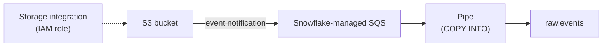

# Snowpipe: Continuous Loading

> Auto-ingesting files from cloud storage as they land, plus the admin side: integrations, monitoring, troubleshooting.

---

## Architecture (AWS)



- Serverless: billed per second of compute plus a small per-file charge. No warehouse needed.
- Latency: usually about a minute after a file lands.
- Dedup: load metadata is kept **14 days**, so the same file name isn't loaded twice.

---

## Step 1: Storage Integration

```sql
USE ROLE ACCOUNTADMIN;
CREATE STORAGE INTEGRATION s3_raw_int
  TYPE = EXTERNAL_STAGE
  STORAGE_PROVIDER = 'S3'
  ENABLED = TRUE
  STORAGE_AWS_ROLE_ARN = 'arn:aws:iam::123456789012:role/snowflake-raw-reader'
  STORAGE_ALLOWED_LOCATIONS = ('s3://acme-raw/events/');

DESC INTEGRATION s3_raw_int;
-- Copy STORAGE_AWS_IAM_USER_ARN and STORAGE_AWS_EXTERNAL_ID
-- into the IAM role's trust policy

GRANT USAGE ON INTEGRATION s3_raw_int TO ROLE data_engineer;
```

## Step 2: Stage & File Format

```sql
USE ROLE data_engineer;
CREATE FILE FORMAT raw.ff_json TYPE = JSON STRIP_OUTER_ARRAY = TRUE;

CREATE STAGE raw.events_stage
  URL = 's3://acme-raw/events/'
  STORAGE_INTEGRATION = s3_raw_int
  FILE_FORMAT = raw.ff_json;

LIST @raw.events_stage;
```

## Step 3: Pipe

```sql
CREATE PIPE raw.events_pipe
  AUTO_INGEST = TRUE
  AS
  COPY INTO raw.events (payload, file_name, loaded_at)
  FROM (SELECT $1, METADATA$FILENAME, CURRENT_TIMESTAMP() FROM @raw.events_stage);

SHOW PIPES LIKE 'events_pipe';
-- Put notification_channel (SQS ARN) into the S3 bucket's event notification
```

---

## Operations

```sql
-- Health check
SELECT SYSTEM$PIPE_STATUS('raw.events_pipe');

-- Pause / resume
ALTER PIPE raw.events_pipe SET PIPE_EXECUTION_PAUSED = TRUE;
ALTER PIPE raw.events_pipe SET PIPE_EXECUTION_PAUSED = FALSE;

-- Backfill files staged in the last 7 days that were missed
ALTER PIPE raw.events_pipe REFRESH;

-- What loaded, what failed (last 24h)
SELECT file_name, status, row_count, first_error_message, last_load_time
FROM TABLE(information_schema.copy_history(
  table_name => 'RAW.EVENTS',
  start_time => DATEADD(hour, -24, CURRENT_TIMESTAMP())))
ORDER BY last_load_time DESC;
```

### Troubleshooting

| Symptom | Check |
|:---|:---|
| Nothing loading | `SYSTEM$PIPE_STATUS`: is `executionState` RUNNING? Is the S3 event notification pointing at the right SQS ARN? |
| Some files skipped | Same file name loaded within 14 days, or file outside the pipe's path prefix |
| Load errors | `COPY_HISTORY` → `first_error_message` |
| High cost | Too many tiny files. Aim for 100–250 MB compressed |

> **⚠️ Gotcha:** Changing a pipe's `COPY` statement means recreating the pipe. Pause it, then use `CREATE OR REPLACE PIPE`, then `REFRESH` to pick up files from the gap.

---

## Cost Monitoring

```sql
SELECT pipe_name, SUM(credits_used) AS credits, SUM(files_inserted) AS files
FROM snowflake.account_usage.pipe_usage_history
WHERE start_time > DATEADD(day, -30, CURRENT_TIMESTAMP())
GROUP BY 1
ORDER BY credits DESC;
```

> **💡 Tip:** For row-level streaming from Kafka or apps, look at **Snowpipe Streaming**. It writes rows directly with no files and lower latency.

## Checklist

- [ ] Storage integrations used (no access keys in stages)
- [ ] `STORAGE_ALLOWED_LOCATIONS` scoped tightly
- [ ] Pipe status and `COPY_HISTORY` errors alerted on
- [ ] Upstream files batched to sensible sizes
