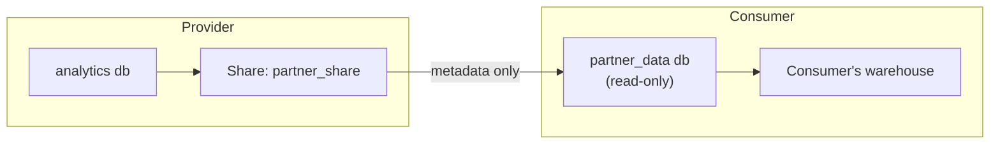

# Snowflake Secure Data Sharing

> Sharing live, read-only data with other accounts. No copies, no ETL.

---

## How It Works

The provider grants objects to a **share**. The consumer creates a database from it. Data stays in the provider's storage, and the consumer queries it with their own warehouse.



| Who pays | For what |
|:---|:---|
| Provider | Storage |
| Consumer | Compute to query it |
| Provider | Compute too, if the consumer is a **reader account** |

---

## Provider Side

```sql
USE ROLE ACCOUNTADMIN;   -- or a role with CREATE SHARE
CREATE SHARE partner_share COMMENT = 'Daily sales for Acme partner';

GRANT USAGE  ON DATABASE analytics                    TO SHARE partner_share;
GRANT USAGE  ON SCHEMA   analytics.shared             TO SHARE partner_share;
GRANT SELECT ON VIEW     analytics.shared.v_daily_sales TO SHARE partner_share;

ALTER SHARE partner_share ADD ACCOUNTS = partnerorg.partner_acct;

SHOW GRANTS TO SHARE partner_share;
```

> **⚠️ Gotcha:** Regular views **can't** be shared. Use **secure views** (`CREATE SECURE VIEW ...`). They hide the view definition and prevent optimizer-based data leakage.

### Per-consumer filtering with one share

```sql
CREATE SECURE VIEW analytics.shared.v_daily_sales AS
SELECT s.*
FROM analytics.marts.daily_sales s
JOIN analytics.shared.partner_map m
  ON s.partner_id = m.partner_id
WHERE m.snowflake_account = CURRENT_ACCOUNT();
```

---

## Consumer Side

```sql
USE ROLE ACCOUNTADMIN;
SHOW SHARES;   -- inbound shares appear with kind = INBOUND

CREATE DATABASE partner_data FROM SHARE provorg.prov_acct.partner_share;

-- Shared databases use IMPORTED PRIVILEGES, not per-object grants
GRANT IMPORTED PRIVILEGES ON DATABASE partner_data TO ROLE analyst;
```

---

## Reader Accounts

For consumers who aren't Snowflake customers. The provider creates and **pays for** a managed account.

```sql
CREATE MANAGED ACCOUNT acme_reader
  ADMIN_NAME = 'acme_admin',
  ADMIN_PASSWORD = '<strong-password>',
  TYPE = READER;

SHOW MANAGED ACCOUNTS;   -- get its locator, then ALTER SHARE ... ADD ACCOUNTS
```

> **💡 Tip:** Put a resource monitor on every reader account's warehouses. Otherwise you're funding someone else's unlimited compute.

---

## Cross-Region & Listings

- Direct shares only work **within the same region and cloud**.
- For other regions, use **listings** (private or Marketplace) with Cross-Cloud Auto-Fulfillment, or replicate the database first.
- Listings also add usage analytics and terms of use.

---

## Auditing

```sql
-- Who is querying my shared data? (provider side, listings only.
-- Direct shares don't expose consumer query history.)
SELECT *
FROM snowflake.data_sharing_usage.listing_access_history
WHERE query_date > DATEADD(day, -30, CURRENT_DATE());

-- What's shared and with whom
SHOW SHARES;
DESC SHARE partner_share;
```

## Checklist

- [ ] Only secure views and specific tables shared, never whole raw schemas
- [ ] Secure views filter by `CURRENT_ACCOUNT()` when one share serves many consumers
- [ ] Reader accounts have resource monitors
- [ ] Shares reviewed quarterly, and stale consumers removed
