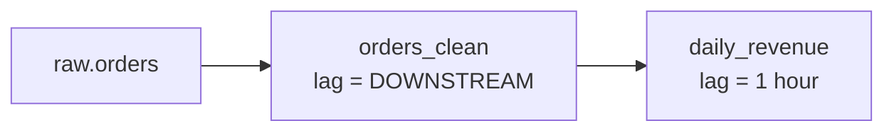

# Snowflake Dynamic Tables

> Declarative pipelines: write the SELECT, set a freshness target, and Snowflake handles the refreshes.

---

## Dynamic Tables vs Streams + Tasks

| | Dynamic tables | Streams + tasks |
|:---|:---|:---|
| You write | A `SELECT` and a `TARGET_LAG` | Stream, MERGE logic, task schedule |
| Incremental logic | Automatic (when the query supports it) | Hand-written |
| Dependencies | Inferred from the query | Explicit `AFTER` graph |
| Good for | Transformations, joins, aggregations | Procedural logic, external calls, fine control |

> **💡 Rule of thumb:** If the step can be expressed as one SELECT, start with a dynamic table.

---

## Creating One

```sql
CREATE OR REPLACE DYNAMIC TABLE analytics.orders_enriched
  TARGET_LAG   = '15 minutes'
  WAREHOUSE    = transform_wh
  REFRESH_MODE = AUTO          -- AUTO | INCREMENTAL | FULL
  INITIALIZE   = ON_CREATE     -- or ON_SCHEDULE
AS
SELECT o.order_id, o.amount, o.created_at, c.segment, c.region
FROM raw.orders o
JOIN raw.customers c ON o.customer_id = c.customer_id;
```

### Chaining with `DOWNSTREAM`

```sql
-- Refresh only as often as whatever depends on it needs
CREATE DYNAMIC TABLE analytics.orders_clean
  TARGET_LAG = DOWNSTREAM
  WAREHOUSE  = transform_wh
AS SELECT * FROM raw.orders WHERE amount > 0;

CREATE DYNAMIC TABLE analytics.daily_revenue
  TARGET_LAG = '1 hour'
  WAREHOUSE  = transform_wh
AS SELECT DATE(created_at) AS day, SUM(amount) AS revenue
   FROM analytics.orders_clean GROUP BY 1;
```



---

## Incremental vs Full Refresh

- `AUTO` picks incremental when it can and falls back to full refresh.
- Check what it chose: `SHOW DYNAMIC TABLES` → `refresh_mode` and `refresh_mode_reason`.
- Non-deterministic functions, some window functions, and certain joins can force a **full** refresh, which is expensive on big tables.

> **⚠️ Gotcha:** Set `REFRESH_MODE = INCREMENTAL` explicitly for large tables. Creation then *fails* if incremental isn't possible, instead of silently running full refreshes forever.

---

## Operations

```sql
SHOW DYNAMIC TABLES IN SCHEMA analytics;

ALTER DYNAMIC TABLE analytics.daily_revenue SUSPEND;
ALTER DYNAMIC TABLE analytics.daily_revenue RESUME;
ALTER DYNAMIC TABLE analytics.daily_revenue REFRESH;              -- manual refresh
ALTER DYNAMIC TABLE analytics.daily_revenue SET TARGET_LAG = '30 minutes';

-- Refresh history and failures
SELECT name, state, state_message, refresh_action, refresh_trigger,
       data_timestamp, refresh_start_time, refresh_end_time
FROM TABLE(information_schema.dynamic_table_refresh_history(
  name_prefix => 'ANALYTICS.'))
ORDER BY refresh_start_time DESC
LIMIT 50;
```

| `refresh_action` | Meaning |
|:---|:---|
| `NO_DATA` | No upstream changes, so nothing ran (cheap) |
| `INCREMENTAL` | Only changes processed |
| `FULL` | Whole table recomputed |
| `REINITIALIZE` | Rebuilt after the definition or upstream changed |

---

## Cost Tips

- Lag drives cost: `'1 minute'` keeps the warehouse busy, `'1 hour'` lets it suspend.
- Give dynamic tables their **own warehouse** so their cost is visible.
- Upstream tables need change tracking. Snowflake enables it automatically if the owner role can; otherwise run `ALTER TABLE raw.orders SET CHANGE_TRACKING = TRUE;`.

## Checklist

- [ ] Target lag matches what the business actually needs
- [ ] Large tables use explicit `INCREMENTAL` mode
- [ ] Refresh failures alerted on via refresh history
- [ ] Intermediate tables use `TARGET_LAG = DOWNSTREAM`
