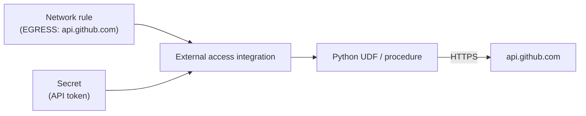

# Snowflake External Access, Secrets & Integrations

> Letting UDFs and procedures call external APIs safely, storing credentials as secrets, and keeping track of integrations.

---

## The Building Blocks



By default, Snowflake code **cannot** reach the internet. An external access integration whitelists specific hosts.

---

## Step 1: Network Rule (Egress)

```sql
USE ROLE ACCOUNTADMIN;
CREATE NETWORK RULE governance.rules.github_egress
  MODE = EGRESS
  TYPE = HOST_PORT
  VALUE_LIST = ('api.github.com:443');
```

## Step 2: Secret

```sql
CREATE SECRET governance.secrets.github_token
  TYPE = GENERIC_STRING
  SECRET_STRING = 'ghp_xxxxxxxxxxxx';

-- Other types: PASSWORD (username + password), OAUTH2, CLOUD_PROVIDER_TOKEN
```

## Step 3: External Access Integration

```sql
CREATE EXTERNAL ACCESS INTEGRATION github_access
  ALLOWED_NETWORK_RULES = (governance.rules.github_egress)
  ALLOWED_AUTHENTICATION_SECRETS = (governance.secrets.github_token)
  ENABLED = TRUE;

GRANT USAGE ON INTEGRATION github_access TO ROLE data_engineer;
GRANT READ  ON SECRET governance.secrets.github_token TO ROLE data_engineer;
GRANT USAGE ON DATABASE governance TO ROLE data_engineer;
GRANT USAGE ON SCHEMA governance.secrets TO ROLE data_engineer;
```

## Step 4: Use It

```sql
CREATE OR REPLACE FUNCTION utils.github_stars(repo STRING)
RETURNS NUMBER
LANGUAGE PYTHON
RUNTIME_VERSION = '3.11'
PACKAGES = ('requests')
HANDLER = 'main'
EXTERNAL_ACCESS_INTEGRATIONS = (github_access)
SECRETS = ('token' = governance.secrets.github_token)
AS
$$
import _snowflake, requests

def main(repo):
    token = _snowflake.get_generic_secret_string('token')
    r = requests.get(f"https://api.github.com/repos/{repo}",
                     headers={"Authorization": f"Bearer {token}"}, timeout=10)
    r.raise_for_status()
    return r.json()["stargazers_count"]
$$;

SELECT utils.github_stars('apache/iceberg');
```

> **⚠️ Gotcha:** The secret's value is never visible again after creation (`DESC SECRET` hides it). Rotate with `ALTER SECRET ... SET SECRET_STRING = '...'`.

---

## Integration Types Cheat Sheet

| Integration | Purpose | Notes in this repo |
|:---|:---|:---|
| `STORAGE` | Stages on S3/GCS/Azure | [10 Snowpipe](10-snowpipe.md) |
| `EXTERNAL ACCESS` | Outbound HTTPS from UDFs/procs | This note |
| `SECURITY` | SSO (SAML), OAuth, SCIM | [03 Users & Auth](03-users-auth-network-security.md) |
| `NOTIFICATION` | Email, SNS, Pub/Sub, Event Grid, webhooks | Alerts, task errors |
| `CATALOG` | Iceberg catalogs | [16 Iceberg](16-iceberg-tables.md) |
| `API` | External functions via API gateway | Older pattern; prefer external access |

---

## Hardening

```sql
-- Force stages to use storage integrations (no keys inline)
ALTER ACCOUNT SET REQUIRE_STORAGE_INTEGRATION_FOR_STAGE_CREATION  = TRUE;
ALTER ACCOUNT SET REQUIRE_STORAGE_INTEGRATION_FOR_STAGE_OPERATION = TRUE;
ALTER ACCOUNT SET PREVENT_UNLOAD_TO_INLINE_URL = TRUE;

-- Inventory
SHOW INTEGRATIONS;
SHOW SECRETS IN ACCOUNT;
SHOW NETWORK RULES IN ACCOUNT;
```

## Checklist

- [ ] Egress allowed only to specific hosts and ports
- [ ] Credentials stored as secrets, never hard-coded in code
- [ ] Secrets live in a locked-down governance schema
- [ ] Stage creation requires storage integrations
- [ ] Integrations reviewed quarterly, unused ones disabled
