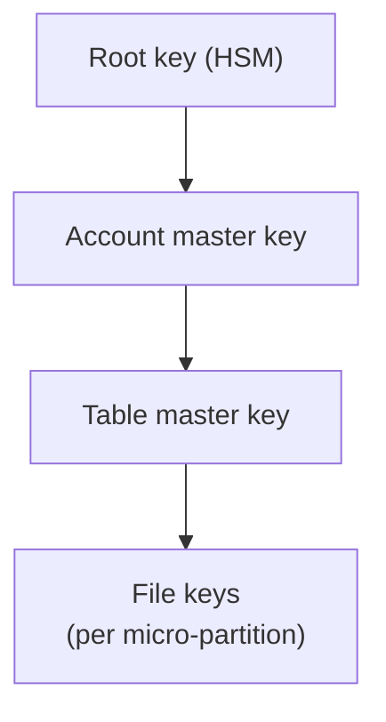

# Snowflake Encryption & Private Connectivity

> How Snowflake encrypts data, customer-managed keys, and keeping traffic off the public internet.

---

## Encryption by Default

- All data is encrypted **at rest** (AES-256) and **in transit** (TLS 1.2+). There's no switch to turn it off.
- Snowflake uses a **hierarchical key model**: root key → account master key → table master keys → file keys.
- Keys are **rotated** automatically every 30 days. Old keys are kept only to decrypt older data.



### Periodic rekeying (Enterprise+)

Rotation protects new data. **Rekeying** goes further and re-encrypts data whose key is older than a year.

```sql
USE ROLE ACCOUNTADMIN;
ALTER ACCOUNT SET PERIODIC_DATA_REKEYING = TRUE;
```

---

## Tri-Secret Secure (Business Critical+)

Combines a Snowflake-managed key with a **customer-managed key (CMK)** in your cloud KMS into a composite master key.

| Benefit | Trade-off |
|:---|:---|
| You can revoke access to all your data by disabling your key | Revoke your key and the account stops working |
| Meets stricter compliance requirements | Key availability is now partly your job |

Setup is done with Snowflake (self-service registration with `SYSTEM$REGISTER_CMK_INFO`, or via Support).

> **⚠️ Gotcha:** Disabling or deleting the CMK makes the data unreadable. Treat that key like production infrastructure: alarms, IAM controls, no accidental deletes.

---

## Private Connectivity (Business Critical+)

Connect over **AWS PrivateLink / Azure Private Link / GCP Private Service Connect** instead of the public internet.

```sql
USE ROLE ACCOUNTADMIN;

-- Get endpoint details to configure on your cloud side
SELECT SYSTEM$GET_PRIVATELINK_CONFIG();

-- AWS: authorize your AWS account to create an endpoint
SELECT SYSTEM$AUTHORIZE_PRIVATELINK(
  '123456789012',
  '<federated token JSON from aws sts get-federation-token>');
```

Then:
1. Create a VPC interface endpoint to the `privatelink-vpce-id` from the config.
2. Add private DNS records for `privatelink-account-url` and related hosts.
3. Point clients at the `*.privatelink.snowflakecomputing.com` URL.

### Block the public path

Once private connectivity works, use a network policy that only allows private endpoint traffic:

```sql
CREATE NETWORK RULE allow_vpce
  TYPE = AWSVPCEID  MODE = INGRESS
  VALUE_LIST = ('vpce-0123456789abcdef0');

CREATE NETWORK POLICY private_only ALLOWED_NETWORK_RULE_LIST = ('allow_vpce');
ALTER ACCOUNT SET NETWORK_POLICY = private_only;
```

> **⚠️ Lockout warning:** Test from a client on the private endpoint before applying this at account level. Apply it to one user first.

### Outbound private connectivity

Snowflake can also reach *your* resources privately (S3 stages, external functions, Azure storage) through privately provisioned endpoints, so stage traffic doesn't touch the public internet either.

---

## Quick Reference by Edition

| Feature | Standard | Enterprise | Business Critical |
|:---|:---:|:---:|:---:|
| Encryption at rest / in transit | ✅ | ✅ | ✅ |
| Automatic key rotation | ✅ | ✅ | ✅ |
| Periodic rekeying | | ✅ | ✅ |
| Tri-Secret Secure | | | ✅ |
| PrivateLink / Private Service Connect | | | ✅ |

## Checklist

- [ ] Periodic rekeying enabled (Enterprise+)
- [ ] CMK protected with alarms and deletion safeguards (if using Tri-Secret Secure)
- [ ] Private endpoints configured and tested
- [ ] Network policy restricts access to private endpoints only
