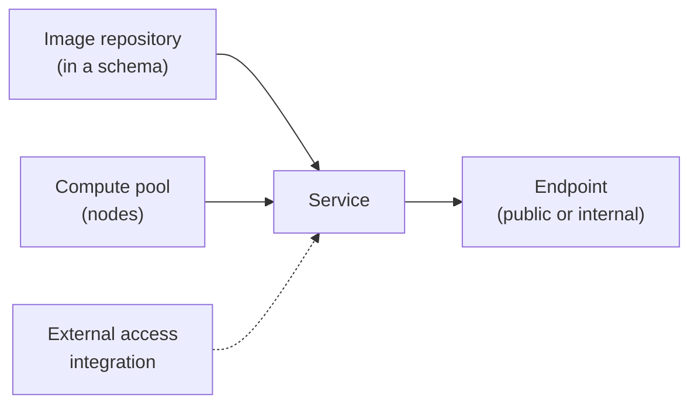

# Snowpark & Snowpark Container Services (Admin View)

> What admins need to set up and watch when teams run Python and containers inside Snowflake.

---

## Snowpark (Python / Java / Scala)

Snowpark code runs on **warehouses**, either as DataFrame queries pushed down to SQL or as UDFs and stored procedures.

### Packages

- Python packages come from the Snowflake Anaconda channel, or from artifact repositories (PyPI).
- ORGADMIN must accept the Anaconda terms once (Snowsight → Admin → Billing & Terms).

```sql
-- What's available?
SELECT * FROM information_schema.packages
WHERE language = 'python' AND package_name = 'scikit-learn';
```

### Snowpark-optimized warehouses

For memory-heavy work (ML training, large in-memory UDFs):

```sql
CREATE WAREHOUSE ml_wh WITH
  WAREHOUSE_SIZE = 'MEDIUM'
  WAREHOUSE_TYPE = 'SNOWPARK-OPTIMIZED'   -- ~16x memory per node
  AUTO_SUSPEND = 60;
```

> **⚠️ Gotcha:** Snowpark-optimized warehouses cost more credits per hour than standard ones of the same size. Use them only where memory is actually the bottleneck.

---

## Snowpark Container Services (SPCS)

Runs your own Docker images on **compute pools** managed by Snowflake.



### Admin setup

```sql
USE ROLE ACCOUNTADMIN;
CREATE ROLE spcs_admin;
GRANT CREATE COMPUTE POOL ON ACCOUNT TO ROLE spcs_admin;
GRANT BIND SERVICE ENDPOINT ON ACCOUNT TO ROLE spcs_admin;   -- needed for public endpoints
GRANT ROLE spcs_admin TO ROLE sysadmin;

USE ROLE spcs_admin;
CREATE COMPUTE POOL app_pool
  MIN_NODES = 1
  MAX_NODES = 3
  INSTANCE_FAMILY = CPU_X64_XS
  AUTO_RESUME = TRUE
  AUTO_SUSPEND_SECS = 600;

CREATE IMAGE REPOSITORY apps.core.images;
SHOW IMAGE REPOSITORIES;   -- repository_url → docker login / docker push target
```

### Creating a service

```sql
CREATE SERVICE apps.core.web_app
  IN COMPUTE POOL app_pool
  FROM SPECIFICATION $$
spec:
  containers:
    - name: app
      image: /apps/core/images/web_app:1.0.0
  endpoints:
    - name: web
      port: 8080
      public: true
$$
  MIN_INSTANCES = 1
  MAX_INSTANCES = 2;
```

### Operating

```sql
SHOW SERVICES IN COMPUTE POOL app_pool;
SHOW SERVICE CONTAINERS IN SERVICE apps.core.web_app;   -- status per container
SHOW ENDPOINTS IN SERVICE apps.core.web_app;            -- public URL

SELECT SYSTEM$GET_SERVICE_LOGS('apps.core.web_app', 0, 'app', 100);

ALTER SERVICE apps.core.web_app SUSPEND;
ALTER COMPUTE POOL app_pool SUSPEND;   -- stops billing (all services must be suspended)
```

> **⚠️ Gotcha:** Compute pools bill per node while they're running, even if services are idle. Set `AUTO_SUSPEND_SECS` and keep `MIN_NODES` low.

---

## Cost Tracking

```sql
SELECT compute_pool_name, SUM(credits_used) AS credits
FROM snowflake.account_usage.snowpark_container_services_history
WHERE start_time > DATEADD(day, -30, CURRENT_TIMESTAMP())
GROUP BY 1
ORDER BY credits DESC;

SHOW COMPUTE POOLS;   -- state, active nodes, instance family
```

## Checklist

- [ ] Anaconda terms accepted, and package policy agreed with security
- [ ] Snowpark-optimized warehouses used only for memory-bound jobs
- [ ] Compute pools have auto-suspend and sensible `MAX_NODES`
- [ ] `BIND SERVICE ENDPOINT` granted only to a dedicated role
- [ ] SPCS credits reviewed with the rest of serverless spend
