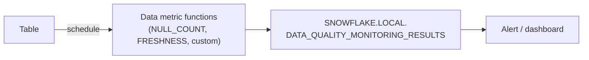

# Data Quality Monitoring with Data Metric Functions

> Scheduled data quality checks built into Snowflake: nulls, duplicates, freshness, and custom rules. (Enterprise+)

---

## How It Works



1. Set a **schedule** on the table.
2. Attach **data metric functions** (DMFs) to columns.
3. Results land in an event table you can query and alert on.

Runs serverless, billed as data quality monitoring compute.

---

## Setup Privileges

```sql
USE ROLE ACCOUNTADMIN;
CREATE ROLE dq_admin;
GRANT EXECUTE DATA METRIC FUNCTION ON ACCOUNT TO ROLE dq_admin;
GRANT DATABASE ROLE snowflake.data_metric_user TO ROLE dq_admin;
GRANT APPLICATION ROLE snowflake.data_quality_monitoring_viewer TO ROLE dq_admin;
```

---

## System DMFs

| DMF | Measures |
|:---|:---|
| `SNOWFLAKE.CORE.NULL_COUNT` | Nulls in a column |
| `SNOWFLAKE.CORE.NULL_PERCENT` | % nulls |
| `SNOWFLAKE.CORE.DUPLICATE_COUNT` | Duplicate values |
| `SNOWFLAKE.CORE.UNIQUE_COUNT` | Distinct non-null values |
| `SNOWFLAKE.CORE.ROW_COUNT` | Rows in the table |
| `SNOWFLAKE.CORE.FRESHNESS` | Seconds since the last update (by timestamp column) |

```sql
-- 1. Schedule
ALTER TABLE analytics.crm.customers SET DATA_METRIC_SCHEDULE = '60 MINUTE';
-- also: 'USING CRON 0 6 * * * UTC' or 'TRIGGER_ON_CHANGES'

-- 2. Attach metrics
ALTER TABLE analytics.crm.customers
  ADD DATA METRIC FUNCTION snowflake.core.null_count ON (email);
ALTER TABLE analytics.crm.customers
  ADD DATA METRIC FUNCTION snowflake.core.duplicate_count ON (customer_id);
ALTER TABLE analytics.crm.customers
  ADD DATA METRIC FUNCTION snowflake.core.freshness ON (updated_at);
```

### Expectations

Define what "good" looks like, so results come with pass/fail:

```sql
ALTER TABLE analytics.crm.customers
  MODIFY DATA METRIC FUNCTION snowflake.core.duplicate_count ON (customer_id)
  ADD EXPECTATION no_dupes (VALUE = 0);
```

---

## Custom DMFs

```sql
CREATE DATA METRIC FUNCTION governance.dq.invalid_email_count(
  arg_t TABLE(arg_c STRING))
RETURNS NUMBER
AS
$$
  SELECT COUNT_IF(arg_c IS NOT NULL
                  AND NOT REGEXP_LIKE(arg_c, '^[^@\\s]+@[^@\\s]+\\.[^@\\s]+$'))
  FROM arg_t
$$;

ALTER TABLE analytics.crm.customers
  ADD DATA METRIC FUNCTION governance.dq.invalid_email_count ON (email);
```

---

## Reading Results

```sql
SELECT measurement_time, table_name, metric_name,
       argument_names, value
FROM snowflake.local.data_quality_monitoring_results
WHERE table_database = 'ANALYTICS'
ORDER BY measurement_time DESC
LIMIT 50;

-- What's attached to a table?
SELECT *
FROM TABLE(information_schema.data_metric_function_references(
  ref_entity_name => 'analytics.crm.customers',
  ref_entity_domain => 'table'));
```

Turn a failing metric into an alert (see [26](26-alerts-and-notifications.md)):

```sql
SELECT table_name, metric_name, value
FROM snowflake.local.data_quality_monitoring_results
WHERE metric_name = 'DUPLICATE_COUNT' AND value > 0
  AND measurement_time > DATEADD(hour, -1, CURRENT_TIMESTAMP());
```

> **⚠️ Gotcha:** Every DMF run costs compute. A 5-minute schedule on dozens of big tables adds up, so use `TRIGGER_ON_CHANGES` or hourly/daily schedules.

## Checklist

- [ ] Freshness and duplicate checks on key tables
- [ ] Expectations defined so failures are obvious
- [ ] Failures alerted on, not just stored
- [ ] DQ compute cost reviewed
