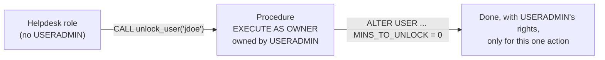

# Stored Procedures: Owner's vs Caller's Rights

> Using stored procedures to give users safe, narrow access to privileged admin actions.

---

## The Three Modes

| `EXECUTE AS` | Runs with privileges of... | Typical use |
|:---|:---|:---|
| `OWNER` (default) | The role that **owns** the procedure | Delegating a specific privileged action |
| `CALLER` | The role **calling** it | Reusable utility logic; no privilege boost |
| `RESTRICTED CALLER` | Caller, but limited to what the owner also allows | Shared code where the owner wants guardrails |



---

## Example: Let Helpdesk Unlock Users

```sql
USE ROLE USERADMIN;
CREATE OR REPLACE PROCEDURE admin.procs.unlock_user(username STRING)
RETURNS STRING
LANGUAGE SQL
EXECUTE AS OWNER
AS
$$
BEGIN
  -- Guardrail: never touch admin users
  IF (UPPER(:username) IN ('ADMIN_JANE', 'SVC_TERRAFORM')) THEN
    RETURN 'Refused: protected user';
  END IF;
  EXECUTE IMMEDIATE 'ALTER USER IDENTIFIER(''' || :username || ''') SET MINS_TO_UNLOCK = 0';
  RETURN 'Unlocked ' || :username;
END;
$$;

GRANT USAGE ON DATABASE admin TO ROLE helpdesk;
GRANT USAGE ON SCHEMA admin.procs TO ROLE helpdesk;
GRANT USAGE ON PROCEDURE admin.procs.unlock_user(STRING) TO ROLE helpdesk;
```

```sql
USE ROLE helpdesk;
CALL admin.procs.unlock_user('jdoe');
```

> **⚠️ Security:** Owner's rights procedures are a privilege escalation path *by design*. Validate every input, avoid building SQL from raw strings where you can (use `IDENTIFIER()` and bind variables), and keep each procedure narrow.

---

## Owner's Rights Restrictions

Inside an `EXECUTE AS OWNER` procedure:

- Can't read or set the caller's **session variables**.
- Limited `ALTER SESSION` and session parameters (they come from the owner's context).
- Callers **can't see the procedure body** unless they own it.
- `CURRENT_ROLE()` returns the owner role. Use `CURRENT_USER()` or session info for auditing who called it.

---

## More Delegation Ideas

| Procedure | Owner role | Called by |
|:---|:---|:---|
| `resize_my_warehouse(size)` with an allowed-sizes list | SYSADMIN | Team leads |
| `refresh_dev_clone()` (clone prod → dev) | SYSADMIN | Developers ([06](06-zero-copy-cloning.md)) |
| `grant_read_on_schema(schema, role)` with an allowlist | SECURITYADMIN | Data owners |
| `create_team_sandbox(team)` | SYSADMIN | Platform team |

---

## Auditing

```sql
-- Who called privileged procedures?
SELECT start_time, user_name, role_name, query_text
FROM snowflake.account_usage.query_history
WHERE query_type = 'CALL'
  AND query_text ILIKE '%admin.procs.%'
  AND start_time > DATEADD(day, -30, CURRENT_TIMESTAMP())
ORDER BY start_time DESC;

SHOW PROCEDURES IN SCHEMA admin.procs;
SHOW GRANTS ON PROCEDURE admin.procs.unlock_user(STRING);
```

## Checklist

- [ ] Admin procedures live in one locked-down schema
- [ ] Each owner's-rights procedure does one narrow thing
- [ ] Inputs validated against allowlists
- [ ] Calls audited from `QUERY_HISTORY`
