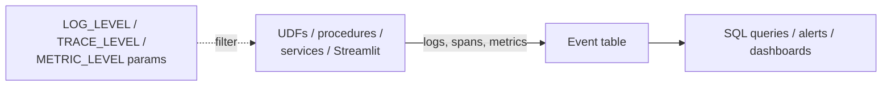

# Event Tables: Logging, Tracing & Metrics

> Capturing logs and traces from UDFs, procedures, Streamlit apps and services, and controlling how much gets recorded.

---

## How It Works



- Every account has a default event table: `SNOWFLAKE.TELEMETRY.EVENTS`.
- You can create your own and make it active for the account (or for specific databases).

```sql
USE ROLE ACCOUNTADMIN;
CREATE EVENT TABLE governance.telemetry.events;
ALTER ACCOUNT SET EVENT_TABLE = governance.telemetry.events;

SHOW PARAMETERS LIKE 'EVENT_TABLE' IN ACCOUNT;
```

---

## Controlling Verbosity

Levels follow the parameter hierarchy (account → database → schema → object), and the most specific setting wins.

```sql
ALTER ACCOUNT SET LOG_LEVEL = 'WARN';               -- quiet default
ALTER DATABASE analytics SET LOG_LEVEL = 'INFO';
ALTER PROCEDURE admin.procs.unlock_user(STRING) SET LOG_LEVEL = 'DEBUG';  -- while debugging

ALTER ACCOUNT SET TRACE_LEVEL = 'ON_EVENT';         -- OFF | ON_EVENT | ALWAYS
ALTER ACCOUNT SET METRIC_LEVEL = 'NONE';            -- NONE | ALL
```

> **⚠️ Gotcha:** `DEBUG` logging and `TRACE_LEVEL = ALWAYS` on busy UDFs can write a *lot* of rows. Event table ingestion is billed as serverless compute, so turn it back down after debugging.

---

## Emitting Logs

**Python**

```python
import logging
logger = logging.getLogger("orders_pipeline")

def main(session):
    logger.info("Starting load")
    try:
        ...
    except Exception:
        logger.exception("Load failed")
        raise
```

**SQL Scripting**

```sql
SYSTEM$LOG_INFO('Starting load');
SYSTEM$LOG_ERROR('Load failed: ' || :err_msg);
```

---

## Querying Logs

```sql
-- Errors in the last day
SELECT timestamp,
       resource_attributes:"snow.executable.name"::STRING AS executable,
       record:"severity_text"::STRING                      AS severity,
       value::STRING                                       AS message
FROM governance.telemetry.events
WHERE record_type = 'LOG'
  AND record:"severity_text"::STRING IN ('ERROR', 'FATAL')
  AND timestamp > DATEADD(day, -1, CURRENT_TIMESTAMP())
ORDER BY timestamp DESC;

-- Slowest spans (traces)
SELECT resource_attributes:"snow.executable.name"::STRING AS executable,
       record:"name"::STRING                               AS span,
       DATEDIFF(millisecond, start_timestamp, timestamp)   AS duration_ms
FROM governance.telemetry.events
WHERE record_type = 'SPAN'
ORDER BY duration_ms DESC
LIMIT 20;
```

Key columns: `TIMESTAMP`, `RESOURCE_ATTRIBUTES` (where it came from), `RECORD_TYPE` (`LOG`, `SPAN`, `SPAN_EVENT`, `METRIC`), `RECORD`, `VALUE`.

---

## Access & Retention

```sql
-- Let a team read the logs without owning the table
GRANT SELECT ON EVENT TABLE governance.telemetry.events TO ROLE data_engineer;

-- Event tables grow forever unless you prune them
DELETE FROM governance.telemetry.events
WHERE timestamp < DATEADD(day, -30, CURRENT_TIMESTAMP());
```

> **💡 Tip:** Schedule the cleanup as a task (see [11](11-streams-and-tasks.md)), and alert on new `ERROR` rows (see [26](26-alerts-and-notifications.md)).

## Checklist

- [ ] Active event table chosen (default or custom)
- [ ] Account `LOG_LEVEL` set to `WARN`, raised only where needed
- [ ] Error-log alert in place
- [ ] Retention cleanup task scheduled
