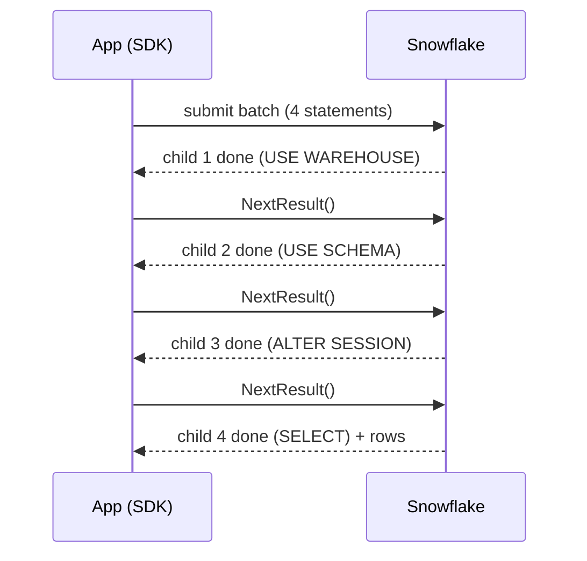

# Case Study: ~300 ms per Statement with the Node.js SDK

> An app team saw ~300 ms of extra latency on every query. Cause: setup statements sent with every request, run one at a time. Fix: move to the SQL API and replace a session parameter the API rejects with explicit SQL.

---

## The Problem

A platform service queried Snowflake through the Node.js SDK (`snowflake-sdk`). Every request was a multi-statement batch where only the last result mattered:

```sql
USE WAREHOUSE <WAREHOUSE>;
USE SCHEMA "DB"."SCHEMA";
ALTER SESSION SET DEFAULT_NULL_ORDERING = 'FIRST', STATEMENT_TIMEOUT_IN_SECONDS = 300;
SELECT * FROM "Table";
```

The team skipped the unwanted results the way the SDK docs describe:

```js
if (!('hasNext' in s)) return;
if (s.hasNext()) return s.NextResult();   // ignore all but the last result
```

Their tracing spans showed the SDK running and waiting on each statement in sequence, adding **~300 ms per query**. In one example, 2.4 s went to the setup statements alone.

**Constraint:** the service uses one connection pool that switches warehouse, database and schema per request. So the context can't be fixed at connection time.

---

## How a Multi-Statement Request Runs



Each statement runs as its own **child query**, in order. `NextResult()` skips *reading* a result, not *running* the statement, so every setup statement still costs a full round trip.

> **💡 Key rule:** In a multi-statement request, skipping a result doesn't skip the work. Cheap statements still cost a round trip each.

---

## Troubleshooting Steps

1. **Separate client time from server time.** Compare the app's spans against `total_elapsed_time` in query history. A large gap points to round trips and the network, not the warehouse.
2. **Look at the gaps between child statements.** Each child has its own `start_time` and `end_time`. Long gaps between one child ending and the next starting are round trips.
3. **Reproduce it in isolation**, measuring one change at a time: connection reuse, then dropping the setup statements, then pooling.
4. **Test every alternative before recommending it**, including how it behaves on edge cases (see Finding 4).

```sql
SELECT query_id, query_type, LEFT(query_text, 60) AS query_text,
       start_time, end_time, compilation_time, execution_time, total_elapsed_time
FROM TABLE(information_schema.query_history_by_session(
       session_id => <SESSION_ID>, result_limit => 50))
ORDER BY start_time;
```

---

## Reproducing It

Everything here runs on a free trial account, against `SNOWFLAKE_SAMPLE_DATA.TPCH_SF1.NATION`.

| File | Purpose |
|:---|:---|
| [`setup.sql`](setup.sql) | Warehouse, role and key-pair service user for testing, plus cleanup |
| [`repro.js`](repro.js) | SDK latency: 4 ways of running the same `SELECT` |
| [`sqlapi_test.js`](sqlapi_test.js) | SQL API: null-ordering options, with no npm packages needed |

```bash
# Node 20+ (macOS: brew install node)
mkdir sf-repro && cd sf-repro && npm init -y && npm install snowflake-sdk

# Key pair. Paste the body of rsa_key.pub into setup.sql, then run setup.sql in Snowsight.
openssl genrsa 2048 | openssl pkcs8 -topk8 -inform PEM -out rsa_key.p8 -nocrypt
openssl rsa -in rsa_key.p8 -pubout -out rsa_key.pub

export SF_ACCOUNT=<org>-<account>      # from the last query in setup.sql
export SF_USER=REPRO_USER SF_ROLE=REPRO_ROLE SF_WAREHOUSE=REPRO_WH
export SF_PRIVATE_KEY_PATH=$PWD/rsa_key.p8

node repro.js
node sqlapi_test.js
```

> **⚠️ Gotcha:** Trial accounts usually enforce MFA on password logins, so scripts need key-pair auth.

---

## Findings

### Finding 1: Each setup statement costs ~300 ms

`repro.js`, 10 runs per scenario plus one warm-up, from a laptop:

| Scenario | Median | p95 |
|:---|---:|---:|
| A: new connection + 4-statement batch (original pattern) | 1,506 ms | 2,292 ms |
| B: reused connection + 4-statement batch | 1,088 ms | 2,036 ms |
| C: reused connection + single `SELECT` | 180 ms | 908 ms |
| D: connection pool + single `SELECT` | 194 ms | 428 ms |

- **B − C ≈ 900 ms** for 3 setup statements, so **~300 ms each**, matching the report.
- **A − B ≈ 420 ms** for opening a connection per request (connect median: 379 ms).
- A → C: **~1.5 s → ~0.18 s.**

Absolute numbers depend on the network distance to Snowflake. Read the gaps between scenarios, not the totals.

### Finding 2: The in-batch `USE WAREHOUSE` was redundant

On a user with no default warehouse, the batch failed outright:

```
No active warehouse selected in the current session.
```

A multi-statement request needs a warehouse on the session **before** it starts. Since the real app's batches succeeded, its session already had a warehouse from somewhere else, so the `USE WAREHOUSE` added a round trip and nothing more.

### Finding 3: The SQL API rejects `DEFAULT_NULL_ORDERING`

The team moved to the [SQL API](https://docs.snowflake.com/en/developer-guide/sql-api/reference) (`POST /api/v2/statements`). It sets `warehouse` / `database` / `schema` per request and lets the client pick which statement results to fetch. Passing null ordering as a request parameter failed:

```
HTTP 400  code=391917
Invalid parameter. 'DEFAULT_NULL_ORDERING' is not allowed or invalid for SQL API.
```

`parameters` accepts **only** a short list: output formats, `timezone`, `query_tag`, `use_cached_result`, `multi_statement_count`, `rows_per_resultset`, `client_result_chunk_size`. A parameter being a valid session parameter elsewhere doesn't mean the SQL API accepts it.

> **💡 Tip:** `STATEMENT_TIMEOUT_IN_SECONDS` isn't on that list either. Use the request body's `timeout` field.

### Finding 4: `NULLS FIRST` is not a drop-in replacement

`sqlapi_test.js` sorts `2, NULL, 1` under each option:

| Test | Request | Result | Verdict |
|:---|:---|:---|:---|
| 0 | Baseline, ASC | `1, 2, NULL` | Default is `LAST` |
| 1 | `DEFAULT_NULL_ORDERING` in `parameters` | HTTP 400 | Rejected |
| 2 | `ALTER SESSION ... FIRST` + `SELECT`, one request | `NULL, 1, 2` | Works |
| 3 | `ORDER BY ... NULLS FIRST` | `NULL, 1, 2` | Works |
| 4 | Baseline again, after Test 2 | `1, 2, NULL` | Setting did **not** carry over to the next request |
| 5 | `ALTER SESSION ... FIRST` + `ORDER BY ... DESC` | `2, 1, NULL` | Original behavior on DESC |
| 6 | `ORDER BY ... DESC NULLS FIRST` | `NULL, 2, 1` | **Differs from Test 5** |
| 7 | `ORDER BY ... DESC NULLS LAST` | `2, 1, NULL` | Matches Test 5 |

`DEFAULT_NULL_ORDERING = 'FIRST'` doesn't mean "NULLs at the top". It means **NULL is the lowest value**: first on `ASC`, **last** on `DESC`. Replacing it with a blanket `NULLS FIRST` would have silently changed results on every descending sort.

> **⚠️ Gotcha:** The exact equivalent of `DEFAULT_NULL_ORDERING = 'FIRST'` is `NULLS FIRST` on `ASC` columns and `NULLS LAST` on `DESC` columns.

> **⚠️ Gotcha:** The SQL API accepted `"MULTI_STATEMENT_COUNT": "2"` (upper-case key, string value). A lower-case key was read as a count of 1 and failed with `Actual statement count 2 did not match the desired statement count 1`.

---

## Solution

| Need | SDK approach (before) | SQL API approach (after) |
|:---|:---|:---|
| Warehouse / database / schema | `USE` statements in every batch | `warehouse`, `database`, `schema` fields per request |
| Null ordering | `ALTER SESSION SET DEFAULT_NULL_ORDERING` | `NULLS FIRST` on ASC, `NULLS LAST` on DESC, in the generated SQL |
| Statement timeout | `ALTER SESSION SET STATEMENT_TIMEOUT_IN_SECONDS` | `timeout` field per request |
| Unwanted results | Walked in sequence with `NextResult()` | Fetch only the statement handle you need |

**Alternative for null ordering:** send `ALTER SESSION SET DEFAULT_NULL_ORDERING = 'FIRST'; <query>` as one request with `"MULTI_STATEMENT_COUNT": "2"` and fetch only the last handle. It works and didn't leak into the next request (Test 4), but adds a statement per request.

**Rejected: user-level default.** `ALTER USER ... SET DEFAULT_NULL_ORDERING` works, but the team flagged the risk: several people can change users in the account, and a changed default would silently alter a production service's results. If it's ever needed, use a dedicated user for that one service, owned by a tightly restricted role.

---

## Lessons

- **Measure each change separately.** Splitting connection cost (A vs B) from statement cost (B vs C) showed which fix mattered most.
- **"Skip the result" ≠ "skip the work".** Round trips, not compute, made cheap statements expensive.
- **Check the SQL API's own parameter list**, not the general parameters page.
- **Test replacements on edge cases.** The ascending test passed; the descending test caught a silent behavior change before it shipped.
- **Prefer settings in the SQL itself** over session or user state that someone else can change.

## Checklist

- [ ] Compare client spans with `total_elapsed_time` before tuning the warehouse
- [ ] No `USE` / `ALTER SESSION` statements repeated on every request
- [ ] Connections reused, not opened per request
- [ ] SQL API requests use only supported `parameters`, with `timeout` set in the body
- [ ] Null ordering explicit per sort column, matching ASC vs DESC semantics
- [ ] Test objects dropped after testing (see `setup.sql`)

**Related notes:** [21 Parameters](../../admin/21-parameters.md) · [27 Query Troubleshooting](../../admin/27-query-troubleshooting.md)

**Docs:** [SQL API reference](https://docs.snowflake.com/en/developer-guide/sql-api/reference) · [DEFAULT_NULL_ORDERING](https://docs.snowflake.com/en/sql-reference/parameters#default-null-ordering) · [Node.js driver](https://docs.snowflake.com/en/developer-guide/node-js/nodejs-driver)
