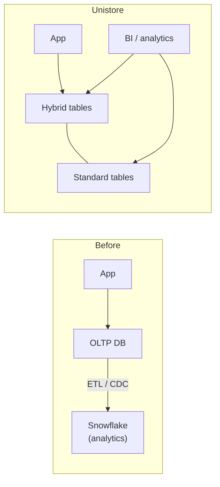

# Hybrid Tables & Unistore: Overview

> Unistore is Snowflake's answer to "transactional and analytical data in one place". Hybrid tables are the table type that makes it work.

---

## The Problem Unistore Solves

Classic architecture: an OLTP database (Postgres, MySQL) for the app, ETL into a warehouse for analytics.

Unistore keeps lightweight transactional data **in Snowflake**, so apps and analytics query the same tables with the same governance and no pipeline in between.

---

## Hybrid vs Standard Tables

| | Standard table | Hybrid table |
|:---|:---|:---|
| Primary storage | Columnar micro-partitions | **Row store**, copied asynchronously to columnar object storage |
| Best at | Large scans, aggregations | Point lookups, single-row inserts/updates, high concurrency |
| Primary key | Optional, **not enforced** | **Required and enforced** |
| UNIQUE / FOREIGN KEY / NOT NULL | Only NOT NULL enforced | **All enforced** |
| Indexes | None (search optimization is async) | Secondary indexes, updated **synchronously** |
| Locking | Partition / table level | **Row level** |
| Typical latency | Hundreds of ms to seconds | Low double-digit ms for indexed lookups |

---

## How Data Flows Inside a Hybrid Table

1. Writes go to the **row store**, the primary copy.
2. Data is copied **asynchronously** to columnar object storage.
3. Point lookups and index scans hit the row store. Large analytical scans can read the columnar copy, which isolates them from the operational workload.

> **💡 Key idea:** You don't choose the engine per query. Snowflake picks the row store or the columnar copy based on the query shape.

---

## Good Fits vs Poor Fits

| Good fit | Poor fit |
|:---|:---|
| App state: orders, sessions, carts, user settings | Multi-TB fact tables |
| Metadata / config tables for pipelines (job state, watermarks) | Append-only event streams (use Snowpipe + standard tables) |
| Serving precomputed features or results by key | Wide-scan analytics |
| Small-to-medium tables with frequent single-row updates | Anything that needs data sharing or replication (see [03](03-limitations-and-availability.md)) |

> **💡 Admin use case:** Pipeline control tables (job runs, high-water marks, locks) are a great first hybrid table. They see constant single-row updates, which standard tables handle poorly because of partition-level locking.

---

## Notes in This Folder

| # | Note |
|:---|:---|
| 01 | Overview (this note) |
| 02 | [Creating Hybrid Tables](02-creating-hybrid-tables.md) |
| 03 | [Limitations & Availability](03-limitations-and-availability.md) |
| 04 | [Cost & Monitoring](04-cost-and-monitoring.md) |
| 05 | [Transactional Patterns Lab](05-transactional-patterns-lab.md) |

**Docs:** [Hybrid tables](https://docs.snowflake.com/en/user-guide/tables-hybrid)
