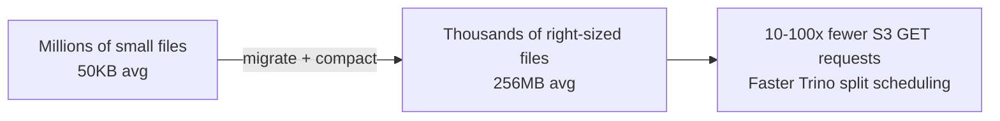
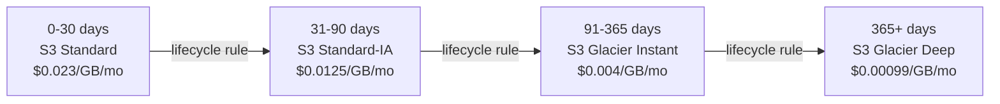
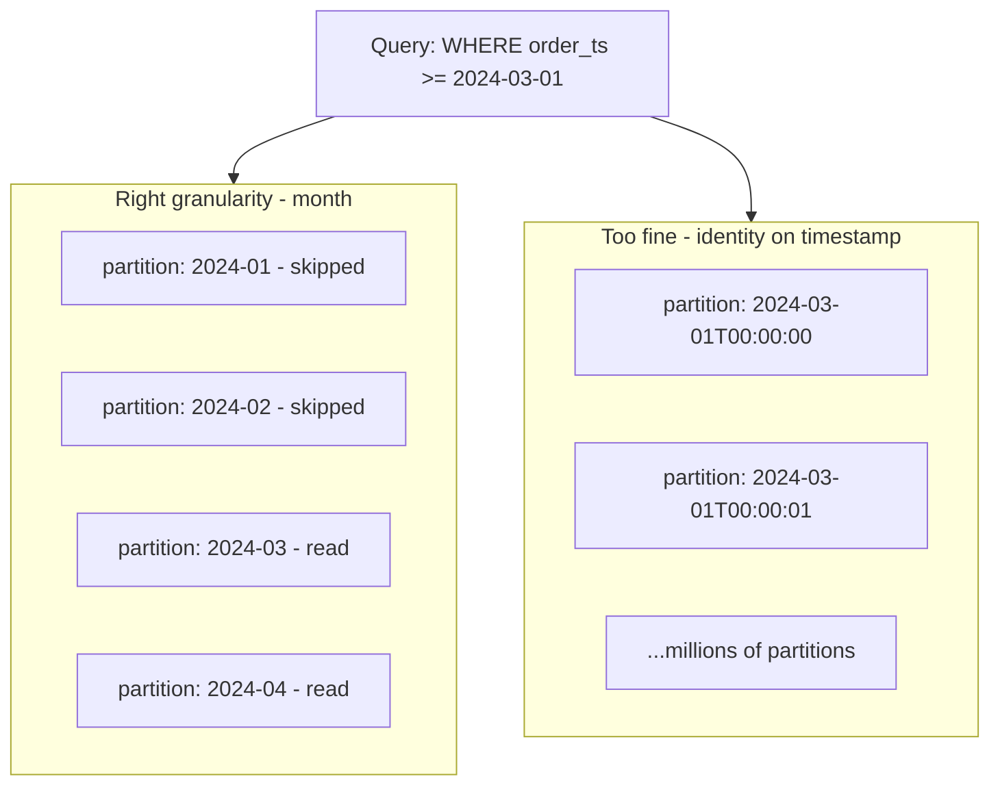
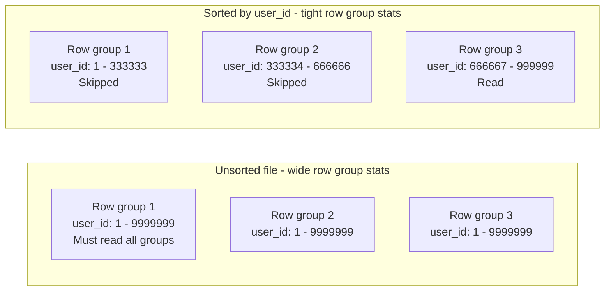
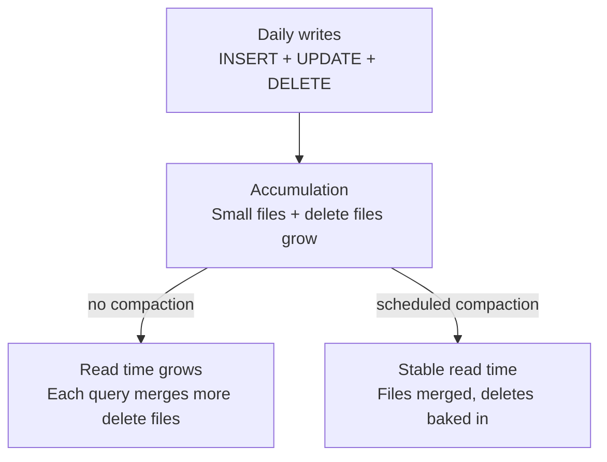
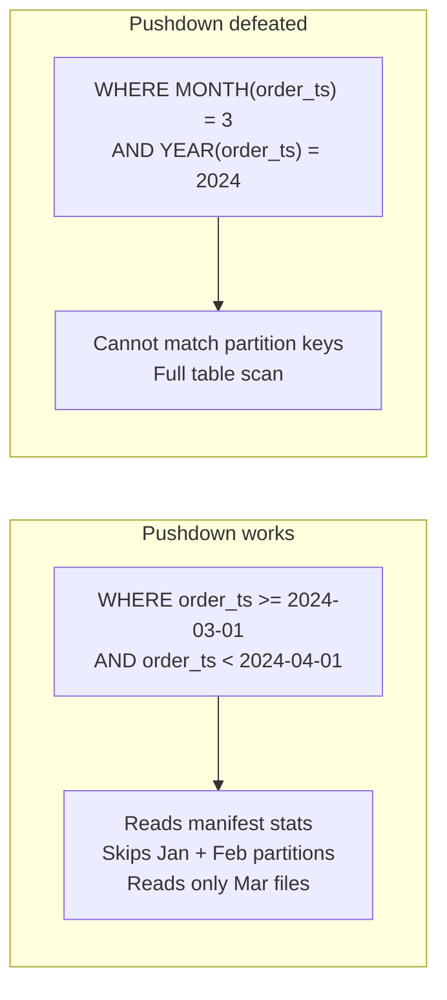
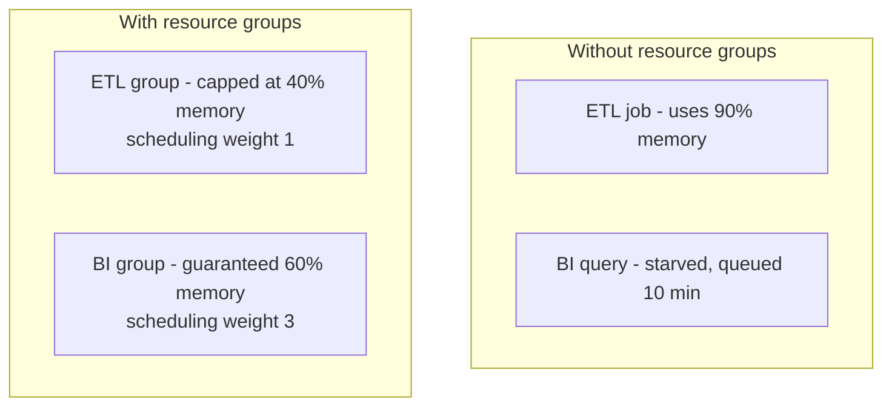
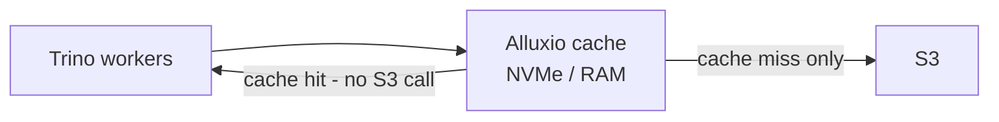

# Iceberg + Trino Optimization Notes

> S3 Parquet → Iceberg → Trino — performance and cost optimizations with real-world impact.

---

## Table of Contents

- [The Core Principle](#the-core-principle)
- [Layer 1 — S3 Storage](#layer-1--s3-storage)
- [Layer 2 — Iceberg Format](#layer-2--iceberg-format)
- [Layer 3 — Trino Query Engine](#layer-3--trino-query-engine)
- [How the Layers Work Together](#how-the-layers-work-together)
- [Migration Quickstart Checklist](#migration-quickstart-checklist)
- [Monitoring Queries](#monitoring-queries)
- [Glossary](#glossary)

---

## The Core Principle

Every optimization in this stack targets one of three levers:

| Lever | How | Benefit |
|---|---|---|
| Read less data | Partition pruning, column stats, sort order | Faster queries + lower S3 cost |
| Store it smarter | Right file size, compression, storage class | Lower storage + GET request cost |
| Compute it cheaper | Join strategy, resource groups, caching | Lower cluster cost + better concurrency |

The layers are not independent. A good Iceberg partition strategy makes Trino predicate pushdown work. Good file sizing reduces S3 GET costs AND Trino split overhead. Fix one layer and you get benefits upstream and downstream.

---

## Layer 1 — S3 Storage

### File sizing



Every Parquet file on S3 = one S3 GET request when Trino reads it. Small files are a double penalty: you pay for many GET requests AND Trino wastes time scheduling thousands of tiny splits.

**Target: 128 MB to 1 GB per file.** The migration itself is your first rewrite opportunity.

> **Impact:** If you had 10 million 50 KB files, compacting to 256 MB files reduces file count to ~2,000. That is a ~5,000x reduction in S3 GET requests and a matching drop in Trino scheduler overhead. Query planning time alone can drop from seconds to milliseconds.

```sql
-- Check your current state after migration
SELECT
    COUNT(*)                                    AS file_count,
    ROUND(AVG(file_size_in_bytes)/1024/1024, 1) AS avg_mb,
    ROUND(MIN(file_size_in_bytes)/1024/1024, 1) AS min_mb,
    ROUND(MAX(file_size_in_bytes)/1024/1024, 1) AS max_mb
FROM iceberg.shop."orders$files";

-- Compact to target size
ALTER TABLE iceberg.shop.orders
EXECUTE optimize(file_size_threshold => '256MB');
```

### Compression codec

| Codec | Ratio | Speed | Use when |
|---|---|---|---|
| Snappy | Low | Fastest | Latency-sensitive, high-throughput reads |
| Zstd (level 3) | High | Fast | **Best default** — good balance |
| Gzip | Highest | Slowest | Cold archival data, rarely queried |
| LZ4 | Lowest | Fastest | Extremely high-throughput ingest pipelines |

> **Impact:** Switching from Snappy to Zstd typically reduces file size by 20–30% with negligible read overhead. On a 10 TB table that is 2–3 TB less S3 storage and proportionally fewer bytes transferred to Trino workers on every scan.

```sql
ALTER TABLE iceberg.shop.orders
SET PROPERTIES write_compression_codec = 'ZSTD';
```

### S3 storage classes

Not all data is queried equally. Most data lakes have a clear access temperature curve.



> **Impact:** A 100 TB data lake where 80% of data is older than 90 days saves approximately $1,500/month by moving cold data to Glacier Instant vs keeping everything in S3 Standard. No query changes needed — Trino reads Glacier Instant at the same speed as Standard.

```json
{
  "Rules": [{
    "Filter": { "Prefix": "warehouse/" },
    "Transitions": [
      { "Days": 30,  "StorageClass": "STANDARD_IA" },
      { "Days": 90,  "StorageClass": "GLACIER_IR" },
      { "Days": 365, "StorageClass": "DEEP_ARCHIVE" }
    ],
    "Status": "Enabled"
  }]
}
```

Use **S3 Intelligent-Tiering** instead if your access patterns are unpredictable — it auto-moves objects between tiers with no retrieval penalty and no lifecycle rule to maintain.

### S3 request cost reduction

S3 charges per GET request ($0.0004 per 1,000 requests). With a badly sized data lake this becomes significant at scale.

| Scenario | Files read per query | Monthly GET cost (1,000 queries/day) |
|---|---|---|
| 50 KB files, 1 TB table | ~20,000,000 | ~$240 |
| 256 MB files, 1 TB table | ~4,000 | ~$0.05 |

---

## Layer 2 — Iceberg Format

### Partition strategy — highest leverage design decision

The partition strategy determines how much data Trino physically reads per query. Wrong granularity is expensive and the hardest thing to change later (though Iceberg's partition evolution helps).



> **Impact:** On a 10 TB table, the right partition strategy can reduce data read per query from 10 TB to 200 GB — a 50x reduction in bytes scanned, compute time, and cost.

| Data volume per day | Recommended partition | Why |
|---|---|---|
| Under 1 TB/day | `month(ts)` | `day()` creates too many tiny partitions |
| 1–10 TB/day | `day(ts)` | Right balance of pruning vs file size |
| Over 10 TB/day | `day(ts)` + `bucket(user_id, 128)` | Composite partition controls skew |
| Event streams, narrow time filters | `hour(ts)` | Only if queries always use narrow windows |

```sql
-- Good: month for moderate volumes
CREATE TABLE iceberg.shop.orders (
    order_id    VARCHAR,
    customer_id VARCHAR,
    order_ts    TIMESTAMP(6) WITH TIME ZONE
) WITH (
    format       = 'PARQUET',
    partitioning = ARRAY['month(order_ts)']
);

-- Good: composite for large skewed tables
CREATE TABLE iceberg.shop.events WITH (
    partitioning = ARRAY['day(event_ts)', 'bucket(user_id, 128)']
);

-- Bad: identity on a high-cardinality column — millions of partitions, manifest bloat
CREATE TABLE iceberg.shop.orders WITH (
    partitioning = ARRAY['identity(customer_id)']
);
```

### Sort order and Z-ordering

Sorting rows within each partition by a commonly-filtered column tightens the min/max column statistics in each Parquet row group. Trino can then skip entire row groups inside a file — not just entire files.



> **Impact:** A 1 TB table sorted by `user_id` within each partition may read only 10–50 MB to answer `WHERE user_id = 'U123'` instead of scanning the full partition. For point-lookup workloads this is a 100–1000x improvement in bytes read.

```sql
-- Set sort order at table creation
CREATE TABLE iceberg.shop.events WITH (
    partitioning = ARRAY['day(event_ts)'],
    sorted_by    = ARRAY['user_id']
);

-- Rewrite an existing partition with sort order applied
ALTER TABLE iceberg.shop.events
EXECUTE optimize
WHERE event_ts >= TIMESTAMP '2024-01-01 00:00:00 UTC';
```

**Z-ordering** (multi-dimensional sort) is used when queries filter on two or more columns equally — for example `user_id` AND `product_id`. It interleaves the bits of both column values so rows that are close in both dimensions cluster together on disk.

```sql
-- Z-order is applied via Spark (not yet native in Trino)
-- Use when you filter equally on 2+ columns
spark.sql("""
    OPTIMIZE iceberg.shop.events
    ZORDER BY (user_id, product_id)
""")
```

### Compaction schedule

Delete files and small files accumulate after every UPDATE, DELETE, and MERGE. Without compaction, every read must merge more and more delete files — query latency degrades linearly over time.



> **Impact:** A table receiving 10,000 row-level deletes per day without compaction can see query time double within a week as Trino merges hundreds of delete files on every scan. Regular compaction keeps read time flat.

```sql
-- Compact files under 256 MB (run daily)
ALTER TABLE iceberg.shop.orders
EXECUTE optimize(file_size_threshold => '256MB');

-- Expire snapshots older than 7 days (frees S3 storage)
ALTER TABLE iceberg.shop.orders
EXECUTE expire_snapshots(retention_threshold => '7d');

-- Remove orphan files not referenced by any snapshot
ALTER TABLE iceberg.shop.orders
EXECUTE remove_orphan_files(retention_threshold => '3d');
```

Recommended schedule:

| Task | Frequency | Why |
|---|---|---|
| `optimize` | Daily | Keep file sizes healthy, bake in deletes |
| `expire_snapshots` | Weekly | Reclaim S3 storage from old snapshots |
| `remove_orphan_files` | Weekly | Clean up files left by failed writes |
| `ANALYZE` | After each large load | Keep CBO statistics fresh |

### Column statistics and the ANALYZE command

Iceberg stores min/max/null-count per column in every manifest file. Trino reads these stats before touching any data file — if the predicate cannot match any row in a file, that file is skipped entirely.

> **Impact:** Without column stats, Trino must open every file. With good stats on a sorted table, Trino can skip 90–99% of files for selective queries. This directly translates to 10–100x faster queries and equivalent cost reduction.

```sql
-- Collect statistics after large loads or compaction
ANALYZE iceberg.shop.orders;

-- Inspect collected stats
SHOW STATS FOR iceberg.shop.orders;

-- Check per-partition stats
SELECT partition, row_count, file_count
FROM iceberg.shop."orders$partitions"
ORDER BY partition DESC;
```

### Partition evolution — change strategy without rewriting

Unlike Hive, Iceberg lets you change the partition strategy on an existing table. Old files keep their original layout; new writes use the new strategy. Trino handles both transparently.

> **Impact:** In Hive, changing partition strategy meant a full table rewrite — often weeks of work and downtime. In Iceberg it is a metadata-only operation that takes seconds.

```sql
-- Evolve from month to day partitioning as data volume grows
ALTER TABLE iceberg.shop.orders
SET PROPERTIES partitioning = ARRAY['day(order_ts)'];
-- Old files still on month layout, new writes use day layout — both work
```

---

## Layer 3 — Trino Query Engine

### Predicate pushdown — let Iceberg do the filtering

Trino's Iceberg connector pushes `WHERE` filters all the way to the manifest file level before a single byte of Parquet is read. This is the most important Trino optimization and it is free — but it only works if you write queries correctly.



> **Impact:** A query that should read 200 GB (one month partition) instead does a full 10 TB scan when the column is wrapped in a function. That is a 50x cost and time difference for a single query change.

```sql
-- GOOD — pushdown works, Trino reads only the March partition
SELECT * FROM iceberg.shop.orders
WHERE order_ts >= TIMESTAMP '2024-03-01 00:00:00 UTC'
  AND order_ts <  TIMESTAMP '2024-04-01 00:00:00 UTC';

-- BAD — function wrapping defeats partition pruning
SELECT * FROM iceberg.shop.orders
WHERE MONTH(order_ts) = 3 AND YEAR(order_ts) = 2024;

-- BAD — implicit cast defeats pushdown
SELECT * FROM iceberg.shop.orders
WHERE CAST(order_ts AS DATE) = DATE '2024-03-15';
```

### Join strategy

For every join, Trino chooses between broadcast (copy the smaller table to every worker) and hash join (repartition both sides). The wrong choice adds massive network shuffle overhead.

| Strategy | When to use | How to force |
|---|---|---|
| Broadcast | Build side is small (under ~1 GB) | `/*+ BROADCAST(alias) */` |
| Hash join | Both sides are large | Default for large tables |
| Cross join | No join condition | Explicit `CROSS JOIN` |

> **Impact:** Joining a 10 TB fact table with a 100 MB dimension table using hash join shuffles 10 TB across the network. Using broadcast instead shuffles only the 100 MB dimension to each worker — a 100x reduction in network traffic and a proportional speedup.

```sql
-- Run ANALYZE so CBO chooses correctly automatically
ANALYZE iceberg.shop.orders;
ANALYZE iceberg.shop.customers;

-- Force broadcast when you know one side is small
SELECT /*+ BROADCAST(c) */
    o.order_id,
    o.total_usd,
    c.name AS customer_name
FROM iceberg.shop.orders   o
JOIN iceberg.shop.customers c ON o.customer_id = c.id;

-- Inspect what plan Trino chose
EXPLAIN (TYPE DISTRIBUTED)
SELECT o.*, c.name
FROM iceberg.shop.orders o
JOIN iceberg.shop.customers c ON o.customer_id = c.id;
```

### Cost-based optimizer (CBO) and ANALYZE

Trino's planner uses table statistics to decide join order, join strategy, and whether to push down filters. Without stats it makes conservative guesses that are often wrong.

> **Impact:** On a 5-table join, the CBO with good statistics can choose an optimal join order that reads 500 GB. Without statistics, Trino may choose a join order that reads 50 TB. This is the difference between a 30-second query and a 50-minute query on the same hardware.

```sql
-- Collect stats on all key tables
ANALYZE iceberg.shop.orders;
ANALYZE iceberg.shop.customers;
ANALYZE iceberg.shop.products;

-- Check what the optimizer knows
SHOW STATS FOR iceberg.shop.orders;

-- See the optimized plan
EXPLAIN (TYPE LOGICAL)
SELECT ...
```

### Resource groups — workload isolation

Without resource groups, a single heavy ETL query can consume all cluster memory and starve interactive BI queries for minutes.



> **Impact:** With resource groups, P99 BI query latency stays stable even during heavy ETL load. Without them, a single runaway query can make dashboards time out for all users simultaneously.

```json
{
  "rootGroups": [{
    "name": "global",
    "maxQueued": 1000,
    "hardConcurrencyLimit": 200,
    "subGroups": [
      {
        "name": "bi",
        "maxQueued": 200,
        "hardConcurrencyLimit": 50,
        "softMemoryLimit": "60%",
        "schedulingWeight": 3
      },
      {
        "name": "etl",
        "maxQueued": 50,
        "hardConcurrencyLimit": 20,
        "softMemoryLimit": "40%",
        "schedulingWeight": 1
      }
    ]
  }]
}
```

### Memory tuning and spill

```properties
# config.properties on workers
query.max-memory=50GB
query.max-memory-per-node=8GB
spill-enabled=true
spiller-spill-path=/mnt/nvme/trino-spill
```

> **Impact:** Without spill, queries that exceed the memory budget fail and must be retried — often manually. With spill enabled on NVMe, those queries complete (slower, but they complete). This is especially important for large aggregations and multi-way joins during ETL.

### Caching with Alluxio

Every Trino worker scan hits S3 and pays for GET requests plus data transfer. Alluxio sits between Trino and S3 as a transparent in-memory/NVMe cache.



> **Impact:** For frequently-queried tables (fact tables, hot partitions, dimension tables), Alluxio cache hit rates of 80–95% are common. This cuts S3 GET costs by 5–20x and reduces query latency by 2–5x since NVMe reads are much faster than S3 network calls.

### Session-level tuning

```sql
-- Increase memory for a specific heavy query
SET SESSION query_max_memory = '100GB';

-- Force a specific number of hash partitions for large aggregations
SET SESSION hash_partition_count = 256;

-- Enable spill for a session
SET SESSION spill_enabled = true;

-- Reduce join broadcast threshold if workers have less memory
SET SESSION join_max_broadcast_table_size = '512MB';
```

---

## How the Layers Work Together

The optimizations compound. Here is a realistic example of what a poorly configured stack vs a well-configured one looks like:

| Scenario | Files read | Data scanned | Query time | Cost per query |
|---|---|---|---|---|
| Unoptimized (small files, no partition, no sort) | 20,000,000 | 10 TB | 45 min | $18.00 |
| Good partitioning only | 4,000,000 | 2 TB | 9 min | $3.60 |
| Partitioning + file compaction | 800 | 400 GB | 2 min | $0.72 |
| Partitioning + compaction + sort order | 160 | 20 GB | 6 sec | $0.04 |
| All of the above + Alluxio cache hit | 0 S3 calls | 0 bytes from S3 | 1 sec | ~$0.00 |

The numbers are illustrative but the shape is real — each layer multiplies the benefit of the previous one.

---

## Migration Quickstart Checklist

Do these in order. Each step has outsized impact early on.

- [ ] **Compact immediately after migration** — merge small Parquet files to 256 MB Iceberg files. Biggest single impact.
- [ ] **Choose the right partition granularity** — `month()` or `day()` based on your most common query filter. Cannot be easily undone.
- [ ] **Set compression to Zstd** — 20–30% storage saving over Snappy at near-zero read cost.
- [ ] **Set sort order on high-cardinality filter columns** — dramatically tightens row group stats.
- [ ] **Set up compaction + snapshot expiry on a schedule** — prevents slow rot from accumulating delete files.
- [ ] **Run `ANALYZE` on all large tables** — feed the CBO so Trino makes smart join decisions.
- [ ] **Set up resource groups** — protect interactive users from ETL jobs.
- [ ] **Add S3 lifecycle policies** — pure cost saving, zero query impact.
- [ ] **Audit queries for function wrapping on partition columns** — most common reason predicate pushdown silently fails.
- [ ] **Consider Alluxio** if the same partitions are queried repeatedly.

---

## Monitoring Queries

### Track file health over time

```sql
-- Run this weekly to catch file size drift
SELECT
    partition,
    file_count,
    ROUND(AVG(file_size_in_bytes)/1024/1024, 1) AS avg_file_mb,
    row_count
FROM iceberg.shop."orders$partitions"
ORDER BY partition DESC
LIMIT 30;
```

### Find queries doing full table scans

```sql
-- In Trino's system tables — find expensive recent queries
SELECT
    query_id,
    state,
    elapsed_time,
    total_bytes_read,
    query
FROM system.runtime.queries
WHERE total_bytes_read > 100000000000  -- over 100 GB
  AND state = 'FINISHED'
ORDER BY total_bytes_read DESC
LIMIT 20;
```

### Check snapshot accumulation

```sql
-- If snapshot count is growing, expiry is not running
SELECT COUNT(*) AS snapshot_count
FROM iceberg.shop."orders$snapshots";

-- Show oldest snapshot — should not be more than 7-14 days old
SELECT MIN(committed_at) AS oldest_snapshot
FROM iceberg.shop."orders$snapshots";
```

### Check delete file accumulation

```sql
-- High delete file count means compaction is not keeping up
SELECT
    content,
    COUNT(*)                                    AS file_count,
    SUM(record_count)                           AS total_deleted_rows,
    ROUND(SUM(file_size_in_bytes)/1024/1024, 1) AS total_mb
FROM iceberg.shop."orders$files"
GROUP BY content;
-- content = 0 → data files, 1 → positional delete files, 2 → equality delete files
```

### Verify predicate pushdown is working

```sql
-- Check physical bytes read vs logical bytes read
-- If physical >> logical something is wrong with pruning
EXPLAIN (TYPE IO)
SELECT COUNT(*) FROM iceberg.shop.orders
WHERE order_ts >= TIMESTAMP '2024-03-01 00:00:00 UTC';
```

---

## Glossary

| Term | Definition |
|---|---|
| **Predicate pushdown** | Sending WHERE filters to the connector so data is skipped before being read |
| **Partition pruning** | Skipping entire partitions based on partition key statistics |
| **Row group pruning** | Skipping Parquet row groups based on column min/max statistics |
| **Compaction** | Merging small files and baking in delete files to produce larger clean files |
| **Z-ordering** | Multi-dimensional sort that clusters rows close in two or more column dimensions |
| **Broadcast join** | Copying the small side of a join to every worker, avoiding a shuffle |
| **Hash join** | Partitioning both sides of a join by the join key and shuffling — used when both sides are large |
| **CBO** | Cost-Based Optimizer — uses table statistics to choose join order and strategy |
| **Resource group** | Named pool of memory and concurrency limits applied to a class of queries |
| **Spill** | Writing intermediate query state to disk when memory budget is exceeded |
| **Alluxio** | Transparent caching layer between Trino and S3, backed by NVMe or RAM |
| **Orphan files** | Data files on S3 not referenced by any Iceberg snapshot — safe to delete |
| **Manifest bloat** | Excessive number of manifest files from too many small writes or fine partitioning |
| **Split** | Trino unit of parallelism — typically one Parquet file or row group |
| **Exchange** | Network shuffle between Trino query stages (hash, broadcast, or gather) |
