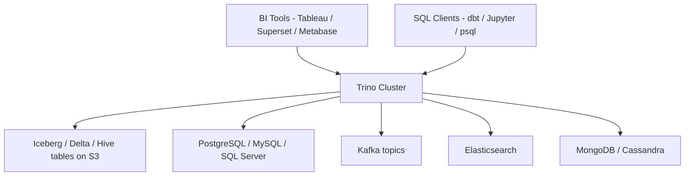
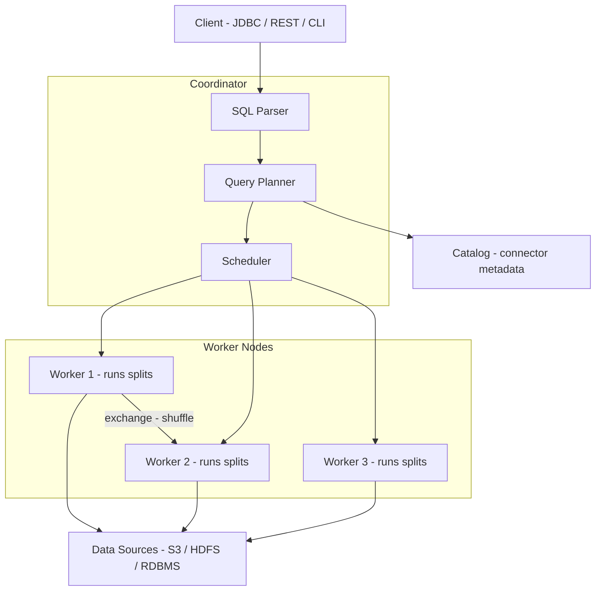
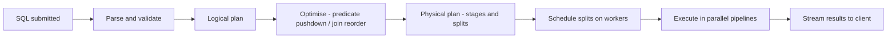
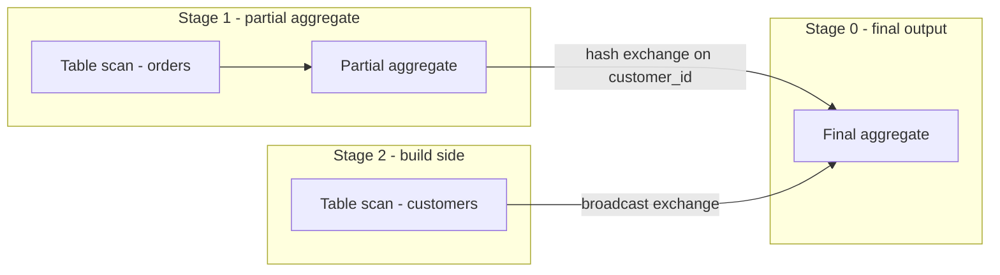

# Trino Notes

> Personal study notes — distributed SQL query engine for data lakes.

---

## Table of Contents

- [What is Trino?](#what-is-trino)
- [How Trino Fits in the Modern Data Stack](#how-trino-fits-in-the-modern-data-stack)
- [Architecture](#architecture)
- [Key Concepts](#key-concepts)
- [Trino + Iceberg](#trino--iceberg)
- [Hands-On: Trino with Docker](#hands-on-trino-with-docker)
- [Performance Tuning](#performance-tuning)
- [Whats Next](#whats-next)
- [Glossary](#glossary)

---

## What is Trino?

Trino (formerly PrestoSQL) is an **open-source distributed SQL query engine** designed to query large datasets across one or many data sources without moving data. You write standard ANSI SQL and Trino figures out how to execute it across S3, Iceberg, Hive, PostgreSQL, Kafka, and dozens of other connectors — all in one query if needed.

Key properties:
- **MPP (Massively Parallel Processing)** — splits every query into thousands of tasks run in parallel across worker nodes.
- **In-memory pipeline** — data flows between stages as a stream; no intermediate disk writes by default.
- **Federation** — join a Postgres table with an Iceberg table and a Kafka topic in a single SQL statement.
- **ANSI SQL** — window functions, CTEs, `UNNEST`, `MERGE`, `MATCH_RECOGNIZE` all supported.

---

## How Trino Fits in the Modern Data Stack



Trino sits between your tools and your data — it never stores data itself. Think of it as a very smart query router and executor.

---

## Architecture



### Coordinator

The single node that receives every query. It parses SQL into an AST, builds a distributed logical and physical plan, then breaks it into **stages** and **splits** that it hands to workers. It never reads data itself.

### Workers

Stateless nodes that execute splits. Each split is a chunk of work — typically reading one Parquet file or one partition. Workers pipeline results to each other via **exchanges** (shuffle, broadcast) and stream the final output back to the coordinator.

### Catalogs and connectors

A catalog is a named data source configured in Trino. Each catalog uses a **connector** — a plugin that translates Trino's internal calls into the storage system's native API.

```
trino.properties / catalog/*.properties
  iceberg.properties  → IcebergConnector  → reads metadata.json → fetches Parquet from S3
  postgresql.properties → PostgreSQLConnector → issues JDBC queries
  tpch.properties     → TpchConnector     → generates synthetic benchmark data in memory
```

### Query lifecycle



---

## Key Concepts

### Splits

The unit of parallelism. For an Iceberg table Trino creates one split per data file (or per row-group inside a file). More splits = more parallelism, up to the number of available worker threads.

### Stages and exchanges

A query is broken into **stages** — each stage is a DAG of operators (scan, filter, project, aggregate, join). Stages communicate via **exchanges**: data is partitioned (hash, range, or broadcast) and shuffled between stages across the network.



### Predicate pushdown

Trino pushes `WHERE` filters down to the connector level. For Iceberg this means the connector reads manifest files, compares column stats (min/max) against the predicate, and skips entire Parquet files before any data is read. The less data Trino touches, the faster the query.

### Cost-based optimizer (CBO)

Trino's planner collects table statistics (row counts, column NDV, histograms) and uses them to choose join order, join strategy (hash vs broadcast), and partition pruning. For Iceberg tables, stats come from the manifest files. Run `ANALYZE TABLE` to refresh them.

### Memory management

Trino is in-memory by default. Each query gets a memory budget:
- `query.max-memory` — total across all workers.
- `query.max-memory-per-node` — per worker limit.

If a query exceeds its budget Trino kills it. For large aggregations or joins you can enable **spill to disk** (`spill-enabled=true`) at the cost of performance.

---

## Trino + Iceberg

Trino has a first-class Iceberg connector. It reads Iceberg metadata directly (no Spark needed) and supports all V2 features.

### Catalog config

```properties
# etc/catalog/iceberg.properties
connector.name=iceberg
iceberg.catalog.type=glue          # or hive_metastore / rest / nessie
hive.metastore.uri=thrift://hive:9083
iceberg.file-format=PARQUET
```

### DDL

```sql
-- Create a table with hidden partitioning
CREATE TABLE iceberg.shop.orders (
    order_id    VARCHAR,
    customer_id VARCHAR,
    product     VARCHAR,
    quantity    INTEGER,
    total_usd   DOUBLE,
    order_ts    TIMESTAMP(6) WITH TIME ZONE
)
WITH (
    format           = 'PARQUET',
    partitioning     = ARRAY['month(order_ts)'],
    sorted_by        = ARRAY['order_ts']
);
```

### DML

```sql
-- Insert
INSERT INTO iceberg.shop.orders VALUES ('O009', 'C1', 'Laptop', 1, 999.99, CURRENT_TIMESTAMP);

-- Update (Iceberg V2 required)
UPDATE iceberg.shop.orders SET total_usd = 899.99 WHERE order_id = 'O001';

-- Delete (Iceberg V2 required)
DELETE FROM iceberg.shop.orders WHERE order_ts < TIMESTAMP '2024-01-01 00:00:00 UTC';

-- Merge
MERGE INTO iceberg.shop.orders t
USING staging.new_orders s ON t.order_id = s.order_id
WHEN MATCHED THEN UPDATE SET total_usd = s.total_usd
WHEN NOT MATCHED THEN INSERT VALUES (s.order_id, s.customer_id, s.product, s.quantity, s.total_usd, s.order_ts);
```

### Time travel

```sql
-- By snapshot ID
SELECT * FROM iceberg.shop.orders FOR VERSION AS OF 6308839735859792256;

-- By timestamp
SELECT * FROM iceberg.shop.orders FOR TIMESTAMP AS OF TIMESTAMP '2024-01-15 00:00:00 UTC';
```

### Iceberg metadata tables

```sql
-- All snapshots
SELECT * FROM iceberg.shop."orders$snapshots";

-- All data files in current snapshot
SELECT * FROM iceberg.shop."orders$files";

-- Manifest files
SELECT * FROM iceberg.shop."orders$manifests";

-- Partition stats
SELECT * FROM iceberg.shop."orders$partitions";

-- Full history
SELECT * FROM iceberg.shop."orders$history";
```

### Maintenance

```sql
-- Compact small files
ALTER TABLE iceberg.shop.orders EXECUTE optimize(file_size_threshold => '128MB');

-- Expire old snapshots (keep last 7 days)
ALTER TABLE iceberg.shop.orders EXECUTE expire_snapshots(retention_threshold => '7d');

-- Remove orphan files
ALTER TABLE iceberg.shop.orders EXECUTE remove_orphan_files(retention_threshold => '7d');
```

---

## Hands-On: Trino with Docker

### Start a local Trino cluster

```bash
# Single-node Trino (coordinator + worker on same container)
docker run -d --name trino -p 8080:8080 trinodb/trino:latest

# Wait ~15s then connect via CLI
docker exec -it trino trino
```

### Explore with the built-in TPCH connector

The `tpch` catalog generates synthetic benchmark data in memory — no files needed.

```sql
-- List catalogs
SHOW CATALOGS;

-- List schemas in tpch
SHOW SCHEMAS FROM tpch;

-- Preview the orders table (SF1 = scale factor 1, ~1.5M rows)
SELECT * FROM tpch.sf1.orders LIMIT 10;

-- Row count
SELECT COUNT(*) FROM tpch.sf1.orders;

-- Simple aggregation
SELECT
    orderstatus,
    COUNT(*)           AS order_count,
    SUM(totalprice)    AS total_revenue,
    AVG(totalprice)    AS avg_order_value
FROM tpch.sf1.orders
GROUP BY orderstatus
ORDER BY total_revenue DESC;

-- Window function — running revenue by month
SELECT
    DATE_TRUNC('month', orderdate) AS month,
    SUM(totalprice)                AS monthly_revenue,
    SUM(SUM(totalprice)) OVER (
        ORDER BY DATE_TRUNC('month', orderdate)
    )                              AS cumulative_revenue
FROM tpch.sf1.orders
GROUP BY 1
ORDER BY 1;

-- Federation: join two tpch schemas (simulates joining two data sources)
SELECT
    c.name        AS customer,
    COUNT(o.orderkey) AS num_orders,
    SUM(o.totalprice) AS lifetime_value
FROM tpch.sf1.orders    o
JOIN tpch.sf1.customer  c ON c.custkey = o.custkey
GROUP BY c.name
ORDER BY lifetime_value DESC
LIMIT 20;
```

### Inspect query plans

```sql
-- See how Trino plans a query
EXPLAIN
SELECT orderstatus, COUNT(*)
FROM tpch.sf1.orders
GROUP BY orderstatus;

-- See the distributed plan (stages and exchanges)
EXPLAIN (TYPE DISTRIBUTED)
SELECT orderstatus, COUNT(*)
FROM tpch.sf1.orders
GROUP BY orderstatus;

-- See the I/O plan (which files / partitions will be read)
EXPLAIN (TYPE IO)
SELECT * FROM tpch.sf1.orders WHERE orderstatus = 'O';
```

### Connect Trino to local Iceberg (Docker Compose)

```yaml
# docker-compose.yml
version: "3.9"
services:
  trino:
    image: trinodb/trino:latest
    ports: ["8080:8080"]
    volumes:
      - ./trino-config/catalog:/etc/trino/catalog

  minio:
    image: minio/minio
    ports: ["9000:9000", "9001:9001"]
    environment:
      MINIO_ROOT_USER: admin
      MINIO_ROOT_PASSWORD: password
    command: server /data --console-address ":9001"

  metastore:
    image: apache/hive:4.0.0
    environment:
      SERVICE_NAME: metastore
    ports: ["9083:9083"]
```

```properties
# trino-config/catalog/iceberg.properties
connector.name=iceberg
iceberg.catalog.type=hive_metastore
hive.metastore.uri=thrift://metastore:9083
hive.s3.endpoint=http://minio:9000
hive.s3.aws-access-key=admin
hive.s3.aws-secret-key=password
hive.s3.path-style-access=true
```

### Query Iceberg from Trino

```sql
-- Create namespace
CREATE SCHEMA iceberg.shop WITH (location = 's3a://warehouse/shop');

-- Create Iceberg table
CREATE TABLE iceberg.shop.orders (
    order_id    VARCHAR,
    customer_id VARCHAR,
    product     VARCHAR,
    quantity    INTEGER,
    total_usd   DOUBLE,
    order_ts    TIMESTAMP(6) WITH TIME ZONE
) WITH (
    format       = 'PARQUET',
    partitioning = ARRAY['month(order_ts)']
);

-- Insert data
INSERT INTO iceberg.shop.orders VALUES
    ('O001', 'C1', 'Laptop',   1, 999.99, TIMESTAMP '2024-01-10 10:00:00 UTC'),
    ('O002', 'C2', 'Mouse',    2,  29.98, TIMESTAMP '2024-01-15 14:00:00 UTC'),
    ('O003', 'C1', 'Keyboard', 1,  79.99, TIMESTAMP '2024-02-05 09:00:00 UTC');

-- Query with partition pruning (Trino reads only Feb partition)
SELECT * FROM iceberg.shop.orders
WHERE order_ts >= TIMESTAMP '2024-02-01 00:00:00 UTC';

-- Inspect snapshots
SELECT snapshot_id, committed_at, operation
FROM iceberg.shop."orders$snapshots"
ORDER BY committed_at;

-- Time travel
SELECT * FROM iceberg.shop.orders
FOR TIMESTAMP AS OF TIMESTAMP '2024-01-20 00:00:00 UTC';

-- Optimize files
ALTER TABLE iceberg.shop.orders EXECUTE optimize(file_size_threshold => '128MB');
```

### Useful system queries

```sql
-- Currently running queries
SELECT query_id, state, elapsed_time, query
FROM system.runtime.queries
WHERE state = 'RUNNING';

-- Active workers and memory
SELECT node_id, http_uri, state, free_memory_bytes
FROM system.runtime.nodes;

-- Tasks for a specific query
SELECT task_id, stage_id, state, splits_scheduled, splits_completed
FROM system.runtime.tasks
WHERE query_id = '<your-query-id>';
```

---

## Performance Tuning

### File sizing

Trino performs best with files between **128 MB and 1 GB**. Too many small files = too many splits = scheduler overhead. Too few large files = not enough parallelism.

```sql
-- Check average file size in your Iceberg table
SELECT
    AVG(file_size_in_bytes) / 1024 / 1024 AS avg_file_mb,
    COUNT(*)                              AS file_count,
    SUM(file_size_in_bytes) / 1024 / 1024 AS total_mb
FROM iceberg.shop."orders$files";

-- Compact if avg is under 64MB
ALTER TABLE iceberg.shop.orders EXECUTE optimize(file_size_threshold => '128MB');
```

### Join strategies

| Strategy | When Trino picks it | Hint to force it |
|---|---|---|
| Broadcast join | Small build side fits in memory | `SELECT /*+ BROADCAST(t) */ ...` |
| Hash join | Both sides large, equi-join | Default for large tables |
| Cross join | No join condition | Explicit `CROSS JOIN` |

### Stats and CBO

```sql
-- Collect table statistics so the optimizer can make better decisions
ANALYZE iceberg.shop.orders;

-- Check what stats are available
SHOW STATS FOR iceberg.shop.orders;
```

### Session properties

```sql
-- Override memory limit for a heavy query
SET SESSION query_max_memory = '8GB';

-- Enable spill to disk for large joins
SET SESSION spill_enabled = true;

-- Force repartition count
SET SESSION hash_partition_count = 128;
```

---

## Whats Next

- [ ] **Fault-tolerant execution** — `retry-policy=TASK` for long-running ETL queries
- [ ] **Trino + dbt** — use dbt with the `dbt-trino` adapter to build models on Iceberg
- [ ] **Access control** — file-based rules, Apache Ranger, or OPA integration
- [ ] **Trino Gateway** — load balancer and router for multi-cluster setups
- [ ] **Caching** — Alluxio or native file descriptor cache to reduce S3 calls
- [ ] **Monitoring** — JMX metrics, Prometheus exporter, Trino UI at port 8080
- [ ] **Resource groups** — isolate workloads (BI vs ETL) with memory and concurrency limits

---

## Glossary

| Term | Definition |
|---|---|
| **Coordinator** | Single node that parses, plans, and schedules every query |
| **Worker** | Stateless node that executes splits and streams results |
| **Catalog** | Named data source backed by a connector (e.g. `iceberg`, `postgresql`) |
| **Connector** | Plugin translating Trino internal calls to a storage system API |
| **Split** | Unit of parallelism — typically one file or row-group |
| **Stage** | A sub-DAG of operators within a query plan |
| **Exchange** | Network shuffle between stages (hash, broadcast, or gather) |
| **Predicate pushdown** | Sending filter conditions to the connector to skip data before reading |
| **CBO** | Cost-based optimizer — uses table stats to choose join order and strategy |
| **MPP** | Massively Parallel Processing — many nodes execute parts of a query simultaneously |
| **Spill** | Writing intermediate data to disk when a query exceeds its memory budget |
| **ANALYZE** | Command to collect column-level statistics for the optimizer |
| **Metadata table** | Hidden Iceberg table exposing snapshots, files, manifests (suffix with `$snapshots` etc.) |
